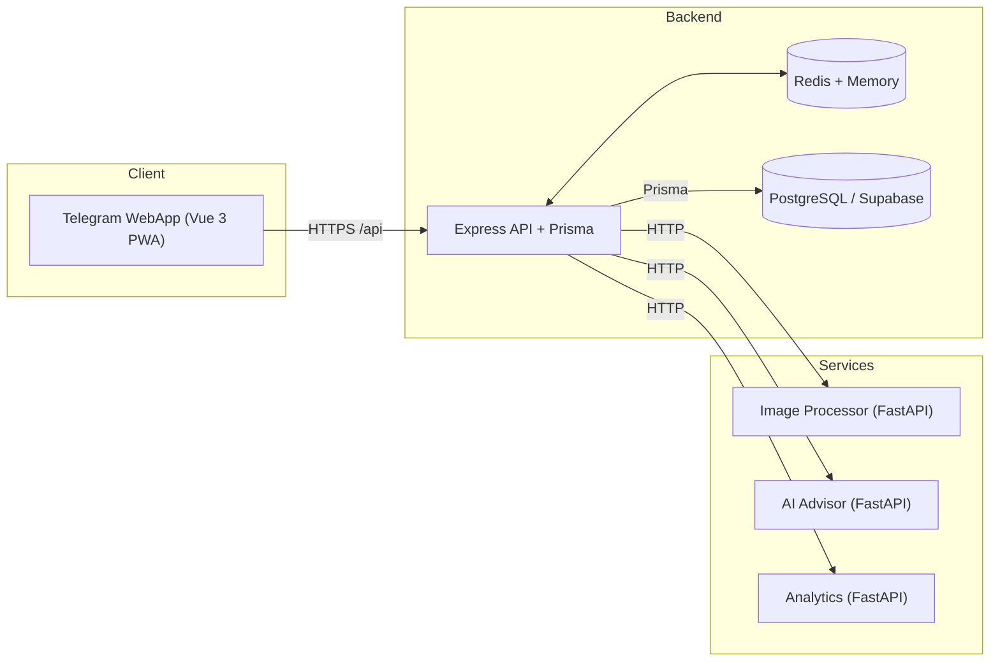
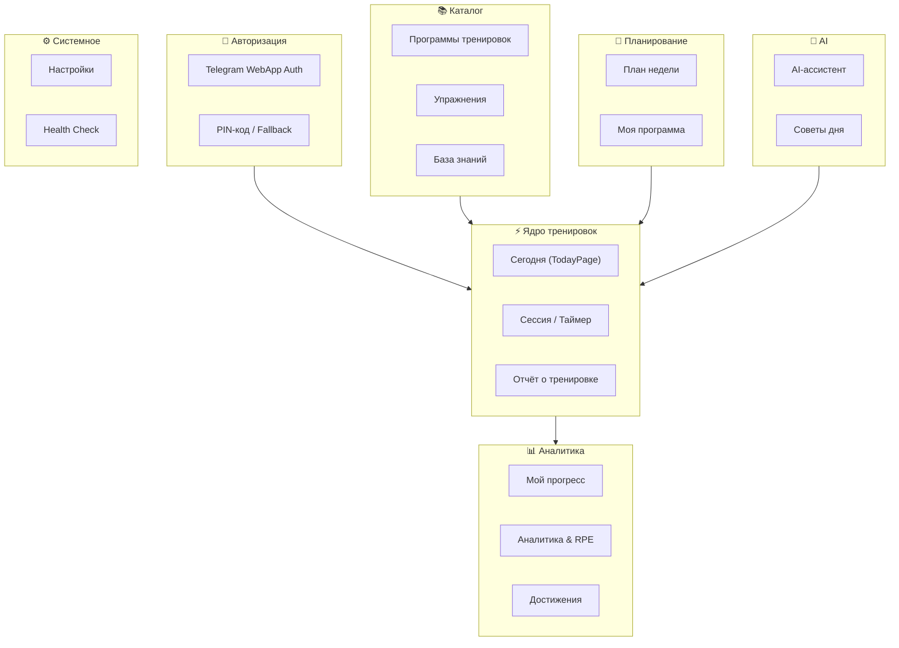
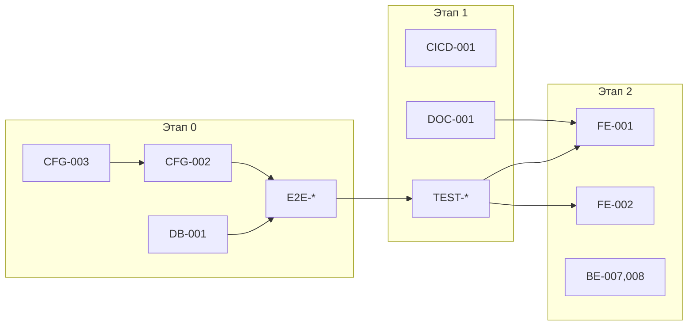
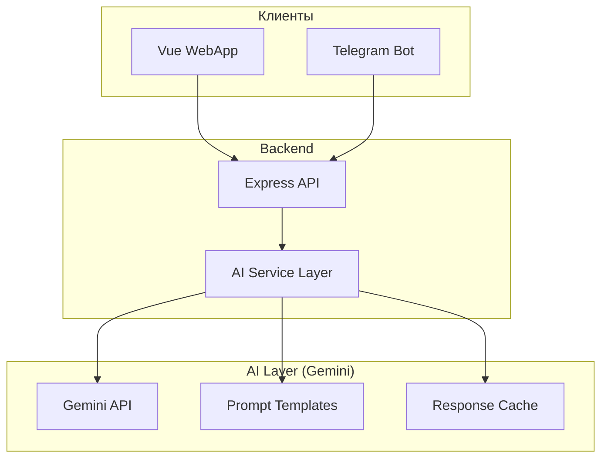
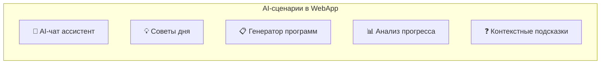
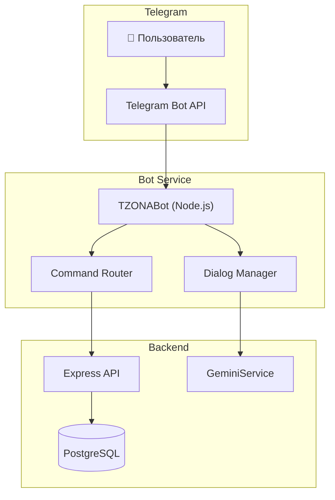

# TZONA V2 — План Улучшения Архитектуры

> **Дата создания:** 2025-12-05  
> **Версия:** 3.2.0 (Complete Edition)  
> **Статус:** В работе

> [!TIP]
> **Быстрый старт:** Если вы новый разработчик — начните с [Этапа 0: Стабилизация](#этап-0-стабилизация-1-2-недели) и [Раздела 20: Функциональные блоки](#20-функциональные-блоки-и-пользовательские-сценарии).

---

## Содержание

1. [Обзор текущего состояния](#1-обзор-текущего-состояния)
2. [Архитектура и структура проекта](#2-архитектура-и-структура-проекта)
3. [Backend / API / Микросервисы](#3-backend--api--микросервисы)
4. [Frontend / Состояние / Маршрутизация](#4-frontend--состояние--маршрутизация)
5. [Разметка и компоненты UI](#5-разметка-и-компоненты-ui)
6. [Стили, дизайн-система и визуальная консистентность](#6-стили-дизайн-система-и-визуальная-консистентность)
7. [Работа с данными, БД, миграции](#7-работа-с-данными-бд-миграции)
8. [Интеграции и end-to-end работа](#8-интеграции-и-end-to-end-работа)
9. [Отсутствующий функционал](#9-отсутствующий-функционал)
10. [Чистая структура (DRY, KISS)](#10-чистая-структура-dry-kiss)
11. [Конфигурация, окружения и запуск](#11-конфигурация-окружения-и-запуск)
12. [Безопасность](#12-безопасность)
13. [Логирование, мониторинг, трассировка](#13-логирование-мониторинг-трассировка)
14. [Тестирование](#14-тестирование)
15. [Производительность](#15-производительность)
16. [DX: Скрипты, линтеры, pre-commit](#16-dx-скрипты-линтеры-pre-commit)
17. [Документация](#17-документация)
18. [CI/CD, сборка и деплой](#18-cicd-сборка-и-деплой)
19. [Детальный анализ ключевых файлов](#19-детальный-анализ-ключевых-файлов)
20. [Функциональные блоки и пользовательские сценарии](#20-функциональные-блоки-и-пользовательские-сценарии)
21. [Риски, зависимости и НФТ](#21-риски-зависимости-и-нфт-non-functional-requirements)
22. **[AI / Gemini и Telegram-бот](#23-ai--gemini-и-интеллектуальные-функции)** ← NEW
23. [Дорожная карта поэтапного рефакторинга](#дорожная-карта-поэтапного-рефакторинга)

---

## 1. Обзор текущего состояния

### Архитектура высокого уровня



### Технологический стек

| Компонент | Технологии |
|-----------|-----------|
| **Frontend** | Vue 3, TypeScript, Vite, Tailwind CSS, Pinia |
| **Backend** | Node.js 20, Express, Prisma ORM, TypeScript |
| **Микросервисы** | Python 3.10+, FastAPI, Pydantic |
| **База данных** | PostgreSQL (Supabase) |
| **Кеш** | Redis + in-memory fallback |
| **Инфраструктура** | Docker Compose, ngrok |

### Структура проекта

```
TZONA/
├── backend/                 # Express + Prisma (TypeScript)
│   ├── src/
│   │   ├── config/          # Конфигурация и константы
│   │   ├── middleware/      # CORS, CSRF, Auth, Rate limiting
│   │   ├── modules/         # 11 доменных модулей
│   │   ├── routes/          # 17 API роутов
│   │   ├── services/        # 27+ сервисов
│   │   └── setup/           # Инициализация приложения
│   ├── prisma/              # Схема и миграции
│   └── migrations/          # 32 SQL миграции
├── frontend/                # Vue 3 + Vite
│   └── src/
│       ├── components/      # UI компоненты
│       ├── composables/     # Vue composables
│       ├── features/        # Core и observability
│       ├── modules/         # Доменные модули
│       ├── pages/           # 8 страниц
│       └── services/        # 12 API сервисов
├── services/                # Python микросервисы
│   ├── ai-advisor/          # LLM советник
│   ├── analytics/           # Аналитика
│   ├── image-processor/     # Обработка изображений
│   └── python_shared/       # Общий код
└── docs/                    # Архитектурная документация
```

### Ключевые проблемы

> [!WARNING]
> **Критические проблемы, требующие немедленного внимания:**

1. **Большие файлы компонентов** — `ExercisesPage.vue` (152KB) содержит слишком много логики
2. **Недоинициализированные модули** — части системы не полностью связаны между собой
3. **Сложный скрипт запуска** — `start-with-ngrok.sh` требует ручных правок при проблемах
4. **Возможные заглушки** — некоторые интеграции с микросервисами могут использовать mock-данные
5. **Дублирование CSS** — стили частично в Tailwind, частично в CSS variables

---

## 2. Архитектура и структура проекта

### Текущее состояние
Проект имеет feature-модульную архитектуру с разделением на 11 доменов в backend и несколько модулей во frontend. Существует базовый DI-контейнер, но связи между модулями не всегда очевидны.

### Целевое состояние
Чистая модульная архитектура с явными границами между слоями (domain/application/infrastructure), типизированными контрактами между модулями и полной изоляцией микросервисов.

### Задачи

#### ARCH-001: Стандартизация структуры модулей Backend
- **Описание:** Привести все 11 модулей к единой структуре папок (controllers, services, repositories, dto, types)
- **Проблема:** Разные модули имеют разную структуру, что усложняет навигацию
- **Польза:** Предсказуемость, упрощение onboarding новых разработчиков
- **Приоритет:** P1 (High)
- **Оценка:** M
- **Теги:** `refactor`, `structure`
- **Тип улучшения:** structure

#### ARCH-002: Введение явных границ слоёв
- **Описание:** Создать shared/contracts для интерфейсов между слоями, запретить прямые импорты между несвязанными модулями через ESLint правила
- **Проблема:** Модули могут импортировать друг друга напрямую, нарушая инкапсуляцию
- **Польза:** Снижение связности, возможность параллельной разработки
- **Приоритет:** P1 (High)
- **Оценка:** M
- **Теги:** `refactor`, `structure`
- **Тип улучшения:** structure

#### ARCH-003: Унификация DI-контейнера
- **Описание:** Расширить существующий `container.ts`, добавить lifecycle management (singleton/transient), типизированные провайдеры
- **Проблема:** Текущий DI неполный, часть зависимостей инжектится вручную
- **Польза:** Тестируемость, гибкость конфигурации
- **Риски:** Требует рефакторинга всех сервисов
- **Приоритет:** P2 (Medium)
- **Оценка:** L
- **Теги:** `refactor`, `infra`
- **Тип улучшения:** structure

#### ARCH-004: Создание Workspace Monorepo
- **Описание:** Настроить npm/pnpm workspaces для backend, frontend, shared types
- **Проблема:** Дублирование типов между frontend и backend
- **Польза:** Переиспользование типов, единый lockfile
- **Приоритет:** P2 (Medium)
- **Оценка:** M
- **Теги:** `infra`, `dx`
- **Тип улучшения:** structure

### Vision / R&D-улучшения (Архитектура)

#### ARCH-V01: Plugin Architecture для микросервисов
- **Описание:** Создать систему плагинов, позволяющую динамически подключать/отключать микросервисы без перезапуска. Каждый сервис регистрируется через discovery mechanism, API Gateway автоматически маршрутизирует запросы.
- **Зачем:** Быстрое A/B тестирование новых сервисов, graceful rollouts, возможность отключить проблемный сервис без влияния на систему.
- **Вау-эффект:** Эластичная архитектура уровня enterprise-продуктов.
- **Приоритет:** P2 (Long-term)
- **Оценка:** L
- **Теги:** `r&d`, `infra`, `feature`
- **Тип:** `vision`

#### ARCH-V02: Real-time Event Bus (WebSocket + Redis Pub/Sub)
- **Описание:** Ввести event-driven коммуникацию между модулями через Redis Pub/Sub. Frontend подписывается через WebSocket на события (workout completed, achievement unlocked, AI advice ready).
- **Зачем:** Мгновенные обновления без polling, collaborative features (если два устройства), live notifications.
- **Вау-эффект:** Приложение ощущается "живым" — изменения видны мгновенно.
- **Приоритет:** P1 (High value)
- **Оценка:** L
- **Теги:** `feature`, `ux`, `infra`
- **Тип:** `vision`

#### ARCH-V03: Feature Flags with Gradual Rollout
- **Описание:** Интегрировать OpenFeature или собственную систему feature flags с UI-панелью для toggle фич. Поддержка canary releases (1% → 10% → 100% пользователей).
- **Зачем:** Безопасный деплой новых фич, instant rollback, A/B testing без редеплоя.
- **Вау-эффект:** Enterprise-grade deployment practices в личном проекте.
- **Приоритет:** P2 (Medium)
- **Оценка:** M
- **Теги:** `infra`, `dx`, `r&d`
- **Тип:** `experimental`

---

## 3. Backend / API / Микросервисы

### Текущее состояние
Express API с 17 роутами, Prisma ORM, интеграция с 3 Python-микросервисами через HTTP. Есть circuit breaker, retry логика, кеширование в Redis.

### Целевое состояние
Полностью типизированный API с OpenAPI спецификацией, контрактное тестирование микросервисов, graceful degradation при недоступности сервисов.

### Задачи

#### BE-001: OpenAPI спецификация для всех эндпоинтов
- **Описание:** Расширить существующий `routes/openapi.ts`, добавить автогенерацию из Zod-схем
- **Проблема:** Документация API неполная, frontend разработчики угадывают формат
- **Польза:** Автогенерация клиентов, Swagger UI, контрактное тестирование
- **Приоритет:** P1 (High)
- **Оценка:** M
- **Теги:** `docs`, `feature`
- **Тип улучшения:** functionality

#### BE-002: Унификация DTO и валидации
- **Описание:** Создать единый паттерн для DTO с Zod-схемами, вынести в отдельный слой
- **Проблема:** Валидация разбросана по роутам, дублируется
- **Польза:** Консистентность, переиспользование, типобезопасность
- **Приоритет:** P1 (High)
- **Оценка:** M
- **Теги:** `refactor`
- **Тип улучшения:** structure

#### BE-003: Стандартизация ответов ошибок
- **Описание:** Ввести единый формат ошибок с кодами, локализацией, trace_id
- **Проблема:** Разные эндпоинты возвращают ошибки в разном формате
- **Польза:** UX, дебаг, мониторинг
- **Приоритет:** P1 (High)
- **Оценка:** S
- **Теги:** `refactor`, `ux`
- **Тип улучшения:** functionality

#### BE-004: Graceful degradation микросервисов
- **Описание:** Реализовать fallback-ответы при недоступности AI Advisor и Analytics
- **Проблема:** При падении микросервиса пользователь видит ошибку
- **Польза:** Устойчивость, лучший UX
- **Приоритет:** P1 (High)
- **Оценка:** M
- **Теги:** `feature`, `infra`
- **Тип улучшения:** functionality

#### BE-005: Контракты между микросервисами
- **Описание:** Создать shared пакет с Pydantic/Zod схемами для API контрактов
- **Проблема:** Node и Python сервисы могут рассинхронизироваться по формату
- **Польза:** Type safety на границах, раннее обнаружение breaking changes
- **Приоритет:** P2 (Medium)
- **Оценка:** M
- **Теги:** `feature`, `infra`
- **Тип улучшения:** structure

#### BE-006: Health checks агрегация
- **Описание:** Расширить `/health` для включения статуса всех микросервисов
- **Проблема:** Нет единой точки проверки здоровья всей системы
- **Польза:** Мониторинг, алертинг, деплой
- **Приоритет:** P1 (High)
- **Оценка:** S
- **Теги:** `infra`, `feature`
- **Тип улучшения:** functionality

### Vision / R&D-улучшения (Backend & Микросервисы)

#### BE-V01: Intelligent Request Orchestrator
- **Описание:** Создать умный API Gateway, который автоматически батчит связанные запросы, кеширует частые паттерны, предсказывает следующие запросы и prefetch'ит данные.
- **Зачем:** Снижение latency на 40-60%, меньше нагрузки на БД, лучший perceived performance.
- **Вау-эффект:** Приложение работает "телепатически" быстро.
- **Приоритет:** P2 (Medium)
- **Оценка:** L
- **Теги:** `perf`, `feature`, `r&d`
- **Тип:** `vision`

#### BE-V02: AI Microservice Mesh с Self-Healing
- **Описание:** Добавить Envoy sidecar или собственный mesh для микросервисов с автоматическим failover, load balancing, circuit breaking на уровне mesh. AI-компонент анализирует паттерны ошибок и предлагает fixes.
- **Зачем:** Self-healing система, автоматическое обнаружение и изоляция проблемных сервисов.
- **Вау-эффект:** Система, которая сама себя чинит.
- **Приоритет:** P3 (Long-term)
- **Оценка:** L
- **Теги:** `infra`, `r&d`
- **Тип:** `long-term`

#### BE-V03: Streaming AI Responses с Markdown Rendering
- **Описание:** Расширить SSE streaming от AI Advisor: рендерить markdown в реальном времени (как ChatGPT), добавить typing indicators, progress для длинных ответов.
- **Зачем:** UX уровня ChatGPT — пользователь видит ответ по мере генерации.
- **Вау-эффект:** Премиальный AI-интерфейс.
- **Приоритет:** P1 (High value)
- **Оценка:** M
- **Теги:** `ux`, `feature`
- **Тип:** `vision`

#### BE-V04: Multi-LLM Router с Cost Optimization
- **Описание:** Создать умный роутер, который выбирает LLM провайдера по типу запроса: простые → Claude Haiku, сложные → GPT-4, критические → ensemble. Мониторинг cost per request.
- **Зачем:** Оптимизация затрат на AI при сохранении качества, fallback между провайдерами.
- **Вау-эффект:** AI infrastructure уровня production AI-продуктов.
- **Приоритет:** P2 (Medium)
- **Оценка:** M
- **Теги:** `perf`, `infra`, `feature`
- **Тип:** `experimental`

---

## 4. Frontend / Состояние / Маршрутизация

### Текущее состояние
Vue 3 + Pinia с 8 страницами. Большие файлы страниц (ExercisesPage.vue — 152KB), смешение UI и бизнес-логики. Lazy loading для роутов.

### Целевое состояние
Feature-sliced архитектура с мелкими переиспользуемыми компонентами, чёткое разделение UI/логики, оптимизированный bundle.

### Задачи

#### FE-001: Декомпозиция ExercisesPage.vue
- **Описание:** Разбить 152KB файл на 5-10 мелких компонентов (ExerciseList, ExerciseCard, ExerciseFilters, ExerciseDetail)
- **Проблема:** Файл слишком большой для ревью и поддержки
- **Польза:** Читаемость, тестируемость, переиспользование
- **Риски:** Много изменений, нужно тщательное тестирование
- **Приоритет:** P0 (Critical)
- **Оценка:** L
- **Теги:** `refactor`
- **Тип улучшения:** structure

#### FE-002: Декомпозиция TodayPage.vue (73KB)
- **Описание:** Аналогично FE-001, выделить SessionCard, WorkoutTimer, ExerciseProgress
- **Проблема:** Второй по размеру файл страницы
- **Польза:** Консистентность с FE-001
- **Приоритет:** P1 (High)
- **Оценка:** M
- **Теги:** `refactor`
- **Тип улучшения:** structure

#### FE-003: Централизация состояния в Pinia
- **Описание:** Перенести локальный state крупных компонентов в Pinia stores
- **Проблема:** Состояние размазано между компонентами и локальным state
- **Польза:** Предсказуемость, devtools, persist
- **Приоритет:** P2 (Medium)
- **Оценка:** M
- **Теги:** `refactor`
- **Тип улучшения:** structure

#### FE-004: Optimistic UI Updates
- **Описание:** Реализовать оптимистичные обновления для CRUD операций
- **Проблема:** UI обновляется только после ответа сервера — лаг ощущается
- **Польза:** Мгновенный отклик, лучший UX
- **Приоритет:** P2 (Medium)
- **Оценка:** M
- **Теги:** `feature`, `ux`
- **Тип улучшения:** functionality, design

#### FE-005: Error Boundaries
- **Описание:** Добавить Vue error boundaries для graceful recovery от UI ошибок
- **Проблема:** Ошибка в компоненте может сломать всё приложение
- **Польза:** Устойчивость, лучший UX
- **Приоритет:** P1 (High)
- **Оценка:** S
- **Теги:** `feature`, `ux`
- **Тип улучшения:** functionality

#### FE-006: Bundle splitting по роутам
- **Описание:** Проверить и оптимизировать code splitting, добавить prefetch для критических роутов
- **Проблема:** Возможно не все роуты оптимально разделены
- **Польза:** Быстрая загрузка, меньше трафика
- **Приоритет:** P2 (Medium)
- **Оценка:** S
- **Теги:** `perf`
- **Тип улучшения:** functionality

### Vision / R&D-улучшения (Frontend)

#### FE-V01: Predictive UI Loading
- **Описание:** Анализировать паттерны навигации пользователя и preload данные/компоненты для вероятных следующих действий. Например, если пользователь на TodayPage в 18:00, prefetch ExercisesPage.
- **Зачем:** Нулевая задержка при навигации, perceived instant loading.
- **Вау-эффект:** Приложение "знает" что нужно пользователю.
- **Приоритет:** P2 (Medium)
- **Оценка:** M
- **Теги:** `perf`, `ux`, `r&d`
- **Тип:** `vision`

#### FE-V02: Offline-First с Background Sync
- **Описание:** Полноценный offline mode: локальное хранение тренировок в IndexedDB, background sync когда сеть вернулась, conflict resolution с UI для merge.
- **Зачем:** Тренировки в метро, на природе, в зале с плохим WiFi.
- **Вау-эффект:** Работает везде, как нативное приложение.
- **Приоритет:** P1 (High value)
- **Оценка:** L
- **Теги:** `feature`, `ux`
- **Тип:** `vision`

#### FE-V03: Voice Commands для Hands-Free тренировок
- **Описание:** Интегрировать Web Speech API для голосового управления во время тренировки: "Готово", "Следующее упражнение", "Пауза таймера".
- **Зачем:** Руки заняты гантелями, нужен hands-free контроль.
- **Вау-эффект:** Футуристичный UX, уникальная фитнес-фича.
- **Приоритет:** P2 (Medium)
- **Оценка:** M
- **Теги:** `feature`, `ux`, `r&d`
- **Тип:** `experimental`

#### FE-V04: Adaptive UI Density
- **Описание:** Динамическая плотность интерфейса: "Compact" для опытных, "Comfortable" для новичков, "Focus" — минимум отвлечений во время тренировки.
- **Зачем:** Разные пользователи предпочитают разный уровень детализации.
- **Вау-эффект:** Персонализация уровня enterprise-софта.
- **Приоритет:** P2 (Medium)
- **Оценка:** M
- **Теги:** `ux`, `design`, `feature`
- **Тип:** `vision`

---

## 5. Разметка и компоненты UI

### Текущее состояние
Базовые UI компоненты (BaseButton, ModalDialog), skeleton loaders, charts. Часть компонентов в `components/`, часть в `modules/shared`. Разметка в целом семантична.

### Целевое состояние
Полная библиотека переиспользуемых UI примитивов с документацией (Storybook), единообразная семантика, accessibility-first.

### Задачи

#### UI-001: Каталог UI компонентов
- **Описание:** Собрать все UI примитивы в `components/ui/`, добавить Storybook
- **Проблема:** Компоненты разбросаны, нет единого каталога
- **Польза:** Переиспользование, документация, дизайн-ревью
- **Приоритет:** P2 (Medium)
- **Оценка:** M
- **Теги:** `feature`, `docs`
- **Тип улучшения:** structure, design

#### UI-002: Стандартизация карточек
- **Описание:** Создать единый компонент Card с вариантами (surface, elevated, bordered)
- **Проблема:** Карточки стилизуются ad-hoc в каждом месте
- **Польза:** Консистентность дизайна
- **Приоритет:** P1 (High)
- **Оценка:** S
- **Теги:** `refactor`, `ux`
- **Тип улучшения:** design

#### UI-003: Улучшение форм
- **Описание:** Создать FormField, FormGroup с встроенной валидацией и ошибками
- **Проблема:** Формы собираются вручную, дублирование
- **Польза:** UX, консистентность, accessibility
- **Приоритет:** P2 (Medium)
- **Оценка:** M
- **Теги:** `feature`, `ux`
- **Тип улучшения:** functionality, design

#### UI-004: Accessibility audit
- **Описание:** Проверить все интерактивные элементы на ARIA, focus management, контраст
- **Проблема:** Accessibility не полностью реализован
- **Польза:** Доступность, SEO, UX
- **Приоритет:** P2 (Medium)
- **Оценка:** M
- **Теги:** `ux`
- **Тип улучшения:** design

#### UI-005: Empty states и пустые экраны
- **Описание:** Добавить красивые empty states для всех списков и таблиц
- **Проблема:** Пустые списки показывают "ничего не найдено" без стиля
- **Польза:** UX, onboarding новых пользователей
- **Приоритет:** P2 (Medium)
- **Оценка:** S
- **Теги:** `ux`, `design`
- **Тип улучшения:** design

### Vision / R&D-улучшения (UI Компоненты)

#### UI-V01: Onboarding Wizard с Progressive Disclosure
- **Описание:** Интерактивный wizard для новых пользователей: выбор целей → уровень подготовки → предпочтения → персонализированная программа. Анимированные подсказки на каждом шаге.
- **Зачем:** Снижение churn новых пользователей, персонализация с первой минуты.
- **Вау-эффект:** Ощущение premium onboarding как у топовых приложений.
- **Приоритет:** P1 (High value)
- **Оценка:** M
- **Теги:** `ux`, `feature`, `design`
- **Тип:** `vision`

#### UI-V02: Micro-Animations Library (Lottie)
- **Описание:** Создать библиотеку Lottie-анимаций для всех состояний: success (конфетти), loading (пульсирующий логотип), error (качающаяся иконка), achievement (взрыв звёзд).
- **Зачем:** Эмоциональный feedback делает приложение запоминающимся.
- **Вау-эффект:** Каждое действие ощущается rewarding.
- **Приоритет:** P2 (Medium)
- **Оценка:** M
- **Теги:** `design`, `ux`
- **Тип:** `vision`

#### UI-V03: Contextual AI Assistant Widget
- **Описание:** Плавающий widget AI-ассистента (как ChatGPT в углу): можно спросить про упражнение, попросить мотивацию, узнать статистику голосом или текстом.
- **Зачем:** Мгновенный доступ к AI из любой точки приложения.
- **Вау-эффект:** Персональный AI-коуч всегда рядом.
- **Приоритет:** P1 (High value)
- **Оценка:** L
- **Теги:** `feature`, `ux`, `r&d`
- **Тип:** `vision`

#### UI-V04: Haptic Feedback Engine
- **Описание:** Система haptic feedback для мобильных: разные паттерны вибрации для success/error/warning, тактильный отклик при swipe, celebration при завершении тренировки.
- **Зачем:** Физическое ощущение прогресса, приложение чувствуется "живым".
- **Вау-эффект:** Мультисенсорный опыт.
- **Приоритет:** P2 (Medium)
- **Оценка:** S
- **Теги:** `ux`, `feature`
- **Тип:** `experimental`

---

## 6. Стили, дизайн-система и визуальная консистентность

### Текущее состояние
CSS Custom Properties в `style.css` (GPT Atlas palette), Tailwind CSS для утилит, поддержка dark mode через `.dark` класс. Токены для цветов, шрифтов, отступов, теней, анимаций определены.

### Целевое состояние
Полная дизайн-система с настраиваемыми акцентными цветами, smooth переключение тем, современные микровзаимодействия в стиле ChatGPT/GPT Atlas.

### Задачи

#### DS-001: Расширение цветовой палитры акцентов
- **Описание:** Добавить 4-5 preset акцентных цветов (Emerald, Violet, Amber, Rose, Cyan), хранить выбор в localStorage
- **Проблема:** Только один accent цвет захардкожен
- **Польза:** Персонализация, вовлечённость
- **Приоритет:** P2 (Medium)
- **Оценка:** M
- **Теги:** `feature`, `ux`
- **Тип улучшения:** design

#### DS-002: Smooth theme transitions
- **Описание:** Добавить `transition: background-color, color 0.3s` для всех элементов при смене темы
- **Проблема:** Переключение темы резкое
- **Польза:** Приятный UX, "полированный" вид
- **Приоритет:** P1 (High)
- **Оценка:** S
- **Теги:** `ux`
- **Тип улучшения:** design

#### DS-003: Hover и active micro-interactions
- **Описание:** Добавить subtle scale, shadow transitions для кнопок, карточек, ссылок
- **Проблема:** Интерактивные элементы статичны
- **Польза:** Отзывчивость, современный вид
- **Приоритет:** P1 (High)
- **Оценка:** S
- **Теги:** `ux`
- **Тип улучшения:** design

#### DS-004: Консолидация Tailwind и Custom Properties
- **Описание:** Убедиться, что Tailwind использует только CSS variables, удалить дублирование
- **Проблема:** Некоторые стили дублируются
- **Польза:** Консистентность, меньше CSS
- **Приоритет:** P1 (High)
- **Оценка:** S
- **Теги:** `refactor`
- **Тип улучшения:** structure

#### DS-005: Типографика и spacing система
- **Описание:** Унифицировать использование font-size и spacing через переменные во всём приложении
- **Проблема:** Часть использует Tailwind классы, часть — кастомный CSS
- **Польза:** Визуальная гармония
- **Приоритет:** P2 (Medium)
- **Оценка:** M
- **Теги:** `refactor`
- **Тип улучшения:** design

#### DS-006: Loading states и skeletons
- **Описание:** Расширить существующие SkeletonCard, добавить skeleton variants для всех типов контента
- **Проблема:** Не все загрузки имеют скелетоны
- **Польза:** Perceived performance, UX
- **Приоритет:** P2 (Medium)
- **Оценка:** M
- **Теги:** `ux`
- **Тип улучшения:** design

### Vision / R&D-улучшения (Дизайн-система)

#### DS-V01: GPT Atlas-style Theme Engine
- **Описание:** Полностью кастомизируемая тема: 10+ preset палитр (Ocean, Forest, Sunset, Monochrome, Neon), HSL-based color picker для создания своей, поддержка gradient backgrounds.
- **Зачем:** Каждый пользователь делает приложение "своим", viral sharing красивых тем.
- **Вау-эффект:** Уровень кастомизации как у ChatGPT/Notion.
- **Приоритет:** P1 (High value)
- **Оценка:** M
- **Теги:** `design`, `ux`, `feature`
- **Тип:** `vision`

#### DS-V02: Glassmorphism & Depth System
- **Описание:** Система слоёв с backdrop-filter blur: модалки, floating panels, tooltips. Subtle shadows для иерархии, frosted glass effect для overlays.
- **Зачем:** Современный премиальный вид, чёткая визуальная иерархия.
- **Вау-эффект:** Интерфейс уровня Apple/Google design.
- **Приоритет:** P2 (Medium)
- **Оценка:** M
- **Теги:** `design`
- **Тип:** `vision`

#### DS-V03: Animated Mesh Gradients Background
- **Описание:** Динамические mesh gradients на фоне, которые плавно анимируются и реагируют на тему/время суток. Утром — тёплые, вечером — cool tones.
- **Зачем:** "Дышащий" интерфейс, который не статичен.
- **Вау-эффект:** Приложение ощущается живым.
- **Приоритет:** P3 (Low, experimental)
- **Оценка:** M
- **Теги:** `design`, `r&d`
- **Тип:** `experimental`

#### DS-V04: Focus Mode Design
- **Описание:** Специальный режим "Focus" во время тренировки: минимальный UI, крупная типографика, высокий контраст, никаких отвлекающих элементов. Автоматически включается при старте тренировки.
- **Зачем:** Фокус на упражнениях, не на интерфейсе.
- **Вау-эффект:** Профессиональный инструмент для серьёзных тренировок.
- **Приоритет:** P1 (High value)
- **Оценка:** M
- **Теги:** `ux`, `design`, `feature`
- **Тип:** `vision`

---

## 7. Работа с данными, БД, миграции

### Текущее состояние
Prisma ORM с 15+ моделями, 32 SQL миграции, материализованные представления, индексы для производительности. Supabase как хостинг PostgreSQL.

### Целевое состояние
Полностью синхронизированная схема, автоматические миграции в CI, seed data для разработки, мониторинг query performance.

### Задачи

#### ✅ DB-001: Аудит синхронизации Prisma и миграций [DONE 2025-12-05]
- **Описание:** Проверить, что все миграции применены, нет drift между schema.prisma и реальной БД
- **Проблема:** Возможны рассинхроны, требующие ручных правок
- **Польза:** Стабильность, уверенность в схеме
- **Приоритет:** P0 (Critical)
- **Оценка:** S
- **Теги:** `bug`, `infra`
- **Тип улучшения:** functionality
- **Результат:** ✅ Схема синхронизирована, 2 миграции (Nov 27), приложение работает 2+ часа стабильно

#### DB-002: Seed data для разработки
- **Описание:** Расширить `prisma/seed.ts` для создания полного тестового набора данных
- **Проблема:** Разработчики вручную создают тестовые данные
- **Польза:** Быстрый старт, одинаковое окружение у всех
- **Приоритет:** P1 (High)
- **Оценка:** M
- **Теги:** `dx`
- **Тип улучшения:** functionality

#### DB-003: Query performance мониторинг
- **Описание:** Интегрировать существующий `prismaQueryLogging.ts` с метриками, настроить алерты на slow queries
- **Проблема:** Медленные запросы обнаруживаются поздно
- **Польза:** Проактивная оптимизация
- **Приоритет:** P2 (Medium)
- **Оценка:** M
- **Теги:** `perf`, `infra`
- **Тип улучшения:** functionality

#### DB-004: Connection pooling оптимизация
- **Описание:** Проверить настройки pgbouncer/Supabase pooler, оптимизировать connection limits
- **Проблема:** Возможны "max clients reached" ошибки
- **Польза:** Стабильность под нагрузкой
- **Приоритет:** P1 (High)
- **Оценка:** S
- **Теги:** `perf`, `infra`
- **Тип улучшения:** functionality

### Vision / R&D-улучшения (Данные & БД)

#### DB-V01: Time-Travel Database для Workout History
- **Описание:** Использовать Supabase point-in-time recovery или EventSourcing для полной истории изменений тренировок. Возможность "откатиться" к любому моменту, сравнить версии программ.
- **Зачем:** Пользователь может вернуться к любой точке прогресса, сравнить эффективность разных программ.
- **Вау-эффект:** Time-machine для фитнеса.
- **Приоритет:** P3 (Long-term)
- **Оценка:** L
- **Теги:** `feature`, `r&d`
- **Тип:** `long-term`

#### DB-V02: Intelligent Data Insights Engine
- **Описание:** Materialized views + scheduled jobs для автоматического расчёта инсайтов: силовой потенциал, recovery rate, optimal training load. Dashboard с персональной аналитикой.
- **Зачем:** Данные превращаются в actionable insights.
- **Вау-эффект:** AI-powered analytics из коробки.
- **Приоритет:** P2 (Medium)
- **Оценка:** L
- **Теги:** `feature`, `perf`
- **Тип:** `vision`

---

## 8. Интеграции и end-to-end работа

### Текущее состояние
Backend интегрируется с 3 Python микросервисами через HTTP. Есть circuit breaker и timeout handling. Некоторые интеграции могут использовать fallback/mock данные.

### Целевое состояние
100% реальные end-to-end потоки без заглушек, health checks для всех internal сервисов, observability на всех границах.

### Задачи

#### ✅ E2E-001: Аудит заглушек и mock-данных [DONE 2025-12-05]
- **Описание:** Проверить все вызовы микросервисов, убедиться что нет hardcoded fallback данных
- **Проблема:** Заглушки могут маскировать реальные проблемы интеграции
- **Польза:** Реальное поведение в production
- **Приоритет:** P0 (Critical)
- **Оценка:** M
- **Теги:** `bug`
- **Тип улучшения:** functionality
- **Результат:** ✅ Нет заглушек и mock-данных. microserviceGateway выбрасывает ошибки без fallback.

#### E2E-002: Проверка AI Advisor интеграции
- **Описание:** Убедиться, что AI Advisor реально вызывает OpenAI/Anthropic, логировать токены и latency
- **Проблема:** Неясно, работает ли AI в production
- **Польза:** Уверенность в функционале
- **Приоритет:** P1 (High)
- **Оценка:** S
- **Теги:** `feature`
- **Тип улучшения:** functionality

#### E2E-003: Проверка Analytics интеграции
- **Описание:** Проверить что аналитика пишется в БД и доступна через API
- **Проблема:** Analytics может быть disabled или использовать mock
- **Польза:** Реальные данные для пользователей
- **Приоритет:** P1 (High)
- **Оценка:** S
- **Теги:** `feature`
- **Тип улучшения:** functionality

#### E2E-004: Трассировка запросов через все сервисы
- **Описание:** Убедиться, что trace_id передаётся и логируется во всех Python сервисах
- **Проблема:** Сложно отследить цепочку запросов при дебаге
- **Польза:** Observability, быстрый дебаг
- **Приоритет:** P1 (High)
- **Оценка:** M
- **Теги:** `infra`
- **Тип улучшения:** functionality

### Vision / R&D-улучшения (Интеграции)

#### INT-V01: Wearables Integration Hub
- **Описание:** Интеграция с Apple Watch, Garmin, Fitbit через соответствующие API. Автоматический импорт пульса, калорий, сна. Синхронизация workouts.
- **Зачем:** Полная картина здоровья пользователя в одном месте.
- **Вау-эффект:** Приложение знает всё о физической активности.
- **Риски:** Сложность API, разные форматы данных.
- **Приоритет:** P2 (Medium)
- **Оценка:** L
- **Теги:** `feature`, `r&d`
- **Тип:** `vision`

#### INT-V02: Smart Home Gym Integration
- **Описание:** Интеграция с IoT-устройствами: умные весы (Withings), эспандеры с датчиками, rowing machines. Автоматический лог нагрузки.
- **Зачем:** Zero-effort tracking, данные собираются автоматически.
- **Вау-эффект:** Gym 4.0 опыт.
- **Приоритет:** P3 (Long-term)
- **Оценка:** L
- **Теги:** `r&d`, `feature`
- **Тип:** `long-term`

#### INT-V03: Distributed Tracing Dashboard
- **Описание:** Встроенный Jaeger/Zipkin UI для визуализации trace через все микросервисы. Timeline view запроса от frontend до DB.
- **Зачем:** Мгновенная диагностика performance issues.
- **Вау-эффект:** Enterprise-grade observability в personal проекте.
- **Приоритет:** P2 (Medium)
- **Оценка:** M
- **Теги:** `infra`, `dx`
- **Тип:** `experimental`

---

## 9. Отсутствующий функционал

### Текущее состояние
Базовый функционал тренировок, упражнений, прогресса реализован. Есть AI советник и аналитика, но степень их интеграции неясна.

### Целевое состояние
Полноценное фитнес-приложение с персонализацией, gamification, social features.

### Задачи

#### FEAT-001: Полноценный AI-коуч
- **Описание:** Реализовать персонализированные рекомендации на основе истории тренировок
- **Проблема:** AI советник может быть generic
- **Польза:** Персонализация, retention
- **Приоритет:** P1 (High)
- **Оценка:** L
- **Теги:** `feature`
- **Тип улучшения:** functionality

#### FEAT-002: Gamification — badges и achievements
- **Описание:** Расширить систему achievements, добавить visual badges, progress bars
- **Проблема:** Существующие achievements не визуализированы
- **Польза:** Мотивация, engagement
- **Приоритет:** P2 (Medium)
- **Оценка:** M
- **Теги:** `feature`, `ux`
- **Тип улучшения:** functionality, design

#### FEAT-003: Прогресс фотографии
- **Описание:** Добавить возможность делать progress photos с timeline view
- **Проблема:** Нет визуального трекинга прогресса
- **Польза:** Мотивация, визуальные результаты
- **Приоритет:** P3 (Low)
- **Оценка:** L
- **Теги:** `feature`
- **Тип улучшения:** functionality

#### FEAT-004: Напоминания и уведомления
- **Описание:** Интегрировать push notifications через Telegram для напоминаний о тренировках
- **Проблема:** Пользователи могут забывать о тренировках
- **Польза:** Retention, engagement
- **Приоритет:** P2 (Medium)
- **Оценка:** M
- **Теги:** `feature`
- **Тип улучшения:** functionality

#### FEAT-005: Экспорт данных
- **Описание:** Добавить экспорт истории тренировок в CSV/PDF
- **Проблема:** Пользователи не могут забрать свои данные
- **Польза:** Trust, GDPR compliance
- **Приоритет:** P3 (Low)
- **Оценка:** S
- **Теги:** `feature`
- **Тип улучшения:** functionality

### Vision / R&D-улучшения (Функционал)

> [!NOTE]
> Vision-задачи по функционалу временно убраны для фокусировки на core-функциях. Приоритет — стабильность и базовые фичи.

---

## 10. Чистая структура (DRY, KISS)

### Текущее состояние
Код в целом следует хорошим практикам, но есть дублирование логики в крупных компонентах и потенциально в API handlers.

### Целевое состояние
Zero duplication, простые и понятные абстракции, код читается как документация.

### Задачи

#### DRY-001: Вынос общей логики из крупных страниц
- **Описание:** Выделить composables для повторяющейся логики (pagination, filters, CRUD)
- **Проблема:** Логика дублируется между ExercisesPage и TodayPage
- **Польза:** Меньше кода, проще поддержка
- **Приоритет:** P1 (High)
- **Оценка:** M
- **Теги:** `refactor`
- **Тип улучшения:** structure

#### DRY-002: Унификация API service layer
- **Описание:** Создать generic CRUD functions в api.ts
- **Проблема:** Каждый эндпоинт имеет свой boilerplate
- **Польза:** Меньше кода, консистентность
- **Приоритет:** P2 (Medium)
- **Оценка:** S
- **Теги:** `refactor`
- **Тип улучшения:** structure

#### DRY-003: Удаление deprecated кода
- **Описание:** Найти и удалить закомментированный код, unused imports, deprecated компоненты
- **Проблема:** Мертвый код усложняет навигацию
- **Польза:** Чистота, меньше bundle size
- **Приоритет:** P1 (High)
- **Оценка:** S
- **Теги:** `refactor`
- **Тип улучшения:** structure

### Vision / R&D-улучшения (DX)

#### DX-V01: Interactive API Playground
- **Описание:** Встроенный playground для тестирования API (как Postman, но в браузере). Автозаполнение из OpenAPI, история запросов, экспорт в curl.
- **Зачем:** Быстрый дебаг и изучение API без внешних инструментов.
- **Вау-эффект:** Developer portal уровня Stripe.
- **Приоритет:** P2 (Medium)
- **Оценка:** M
- **Теги:** `dx`, `feature`
- **Тип:** `vision`

#### DX-V02: Hot Module Replacement для Backend
- **Описание:** HMR для backend с сохранением состояния (connections, cache). Изменения в коде применяются без перезапуска сервера.
- **Зачем:** Мгновенный feedback loop, нет потери состояния при разработке.
- **Вау-эффект:** Frontend-level DX для backend.
- **Приоритет:** P3 (Low)
- **Оценка:** M
- **Теги:** `dx`, `r&d`
- **Тип:** `experimental`

#### DX-V03: Telegram Bot команды для тестовых пользователей
- **Описание:** Добавить бот-команды для разработки: `/testuser create` — создать тестового пользователя с данными, `/testuser list` — список тестовых аккаунтов, `/testuser switch <id>` — переключиться на тестового пользователя.
- **Зачем:** QA и разработка без ручного создания данных через UI или SQL.
- **Сценарии:** Тестирование пустого профиля, профиля с историей, edge cases.
- **Приоритет:** P2 (Medium)
- **Оценка:** S
- **Теги:** `dx`, `bot`, `feature`
- **Тип:** `feature`

---

## 11. Конфигурация, окружения и запуск

### Текущее состояние
Единый `.env` файл в корне, `start-with-ngrok.sh` для dev запуска. Скрипт делает cleanup, проверки, инъекцию env variables, запуск всех сервисов через concurrently.

### Целевое состояние
Docker-based dev environment, никакой мутации файлов, stable one-command startup, preview environments.

### Задачи

#### CFG-001: Docker Compose для full dev environment
- **Описание:** Расширить docker-compose.yml для полного dev окружения (backend, frontend, все сервисы)
- **Проблема:** Текущий скрипт требует локальных зависимостей и может ломаться
- **Польза:** Воспроизводимость, isolation
- **Приоритет:** P1 (High)
- **Оценка:** M
- **Теги:** `dx`, `infra`
- **Тип улучшения:** functionality

#### ✅ CFG-002: Упрощение start-with-ngrok.sh [DONE 2025-12-05]
- **Описание:** Рефакторинг скрипта: убрать runtime env injection, использовать .env.local, добавить error handling
- **Проблема:** Скрипт сложный, при ошибках неясно что делать
- **Польза:** Надёжность, понятность
- **Приоритет:** P0 (Critical)
- **Оценка:** M
- **Теги:** `dx`, `bug`
- **Тип улучшения:** functionality
- **Результат:** ✅ Удалён hardcoded DATABASE_URL с паролем, добавлена динамическая модификация из .env для pgbouncer, валидация переменных

#### ✅ CFG-003: Удаление hardcoded secrets [DONE 2025-12-05]
- **Описание:** Вынести NGROK_TOKEN и другие secrets из скрипта в .env
- **Проблема:** Token захардкожен в `start-with-ngrok.sh`
- **Польза:** Безопасность
- **Приоритет:** P0 (Critical)
- **Оценка:** S
- **Теги:** `security`
- **Тип улучшения:** functionality
- **Результат:** ✅ NGROK_TOKEN вынесен из скрипта в .env, добавлена валидация, добавлен в .env.example

#### CFG-004: Healthcheck после старта
- **Описание:** Добавить в скрипт проверку что все сервисы здоровы перед выводом "Ready"
- **Проблема:** Скрипт показывает успех раньше, чем сервисы готовы
- **Польза:** Уверенность что всё работает
- **Приоритет:** P1 (High)
- **Оценка:** S
- **Теги:** `dx`
- **Тип улучшения:** functionality

#### CFG-005: Environment validation
- **Описание:** Добавить upfront валидацию всех required env vars перед запуском
- **Проблема:** Ошибки обнаруживаются в runtime
- **Польза:** Fail fast, понятные сообщения
- **Приоритет:** P1 (High)
- **Оценка:** S
- **Теги:** `dx`
- **Тип улучшения:** functionality

**Креативные идеи:**
1. **devcontainer** — VSCode Dev Container для zero-setup experience
2. **Makefile** — единый интерфейс команд (make dev, make test, make build)
3. **Auto-ngrok URL** — автоматическое обновление Telegram WebApp URL

---

## 12. Безопасность

### Текущее состояние
Есть CSRF защита, JWT auth, rate limiting, input sanitization, Telegram initData validation. Secrets в .env файлах.

### Целевое состояние
Security-first подход, регулярные аудиты, secrets management, OWASP compliance.

### Задачи

#### SEC-001: Secrets management
- **Описание:** Использовать vault или encrypted secrets вместо plain .env
- **Проблема:** .env файлы могут утечь
- **Польза:** Безопасность
- **Приоритет:** P2 (Medium)
- **Оценка:** M
- **Теги:** `security`
- **Тип улучшения:** functionality

#### SEC-002: Dependency audit automation
- **Описание:** Настроить npm audit и Snyk в CI, блокировать PR с critical vulnerabilities
- **Проблема:** Уязвимости не отслеживаются автоматически
- **Польза:** Проактивная безопасность
- **Приоритет:** P1 (High)
- **Оценка:** S
- **Теги:** `security`, `infra`
- **Тип улучшения:** functionality

#### SEC-003: Rate limiting review
- **Описание:** Проверить настройки rate limiting, добавить per-user limits
- **Проблема:** Глобальный rate limit может быть обойдён
- **Польза:** Защита от abuse
- **Приоритет:** P2 (Medium)
- **Оценка:** S
- **Теги:** `security`
- **Тип улучшения:** functionality

#### SEC-004: OWASP Top 10 audit
- **Описание:** Провести аудит приложения на соответствие OWASP Top 10 2021
- **Проблема:** Нет формальной проверки на основные уязвимости
- **Польза:** Системная безопасность, checklist для будущих изменений
- **Приоритет:** P2 (Medium)
- **Оценка:** M
- **Теги:** `security`, `analysis`
- **Тип улучшения:** functionality

#### SEC-005: Input validation audit
- **Описание:** Проверить все API endpoints на валидацию входных данных (zod schemas)
- **Проблема:** Возможны endpoints без строгой валидации
- **Польза:** Защита от injection, неожиданных данных
- **Приоритет:** P1 (High)
- **Оценка:** M
- **Теги:** `security`, `refactor`
- **Тип улучшения:** functionality

---

## 13. Логирование, мониторинг, трассировка

### Текущее состояние
Pino logger с JSON output, trace_id через AsyncLocalStorage, observability events в БД. Есть `metricsDashboard.ts`.

### Целевое состояние
Централизованный logging platform, real-time metrics dashboard, alerting.

### Задачи

#### OBS-001: Structured logging стандартизация
- **Описание:** Убедиться что все логи следуют единому формату (level, trace_id, module, message, data)
- **Проблема:** Формат логов может различаться
- **Польза:** Парсинг, поиск, анализ
- **Приоритет:** P2 (Medium)
- **Оценка:** S
- **Теги:** `infra`
- **Тип улучшения:** functionality

#### OBS-002: Metrics export (Prometheus)
- **Описание:** Добавить /metrics эндпоинт в Prometheus формате
- **Проблема:** Метрики только внутренние
- **Польза:** Интеграция с Grafana, alerting
- **Приоритет:** P2 (Medium)
- **Оценка:** M
- **Теги:** `infra`, `feature`
- **Тип улучшения:** functionality

#### OBS-003: Error tracking integration
- **Описание:** Интегрировать Sentry или аналог для автоматического capture ошибок
- **Проблема:** Ошибки теряются в логах
- **Польза:** Быстрое обнаружение и fix
- **Приоритет:** P1 (High)
- **Оценка:** M
- **Теги:** `infra`
- **Тип улучшения:** functionality

---

## 14. Тестирование

### Текущее состояние
Vitest для unit/integration/e2e, snapshot тесты для frontend, тесты миграций. Coverage неопределён.

### Целевое состояние
80%+ coverage, contract tests для микросервисов, visual regression tests.

### Задачи

#### TEST-001: Coverage measurement и targets
- **Описание:** Настроить coverage reporting в CI, установить targets (80% lines)
- **Проблема:** Coverage неизвестен
- **Польза:** Уверенность в качестве
- **Приоритет:** P1 (High)
- **Оценка:** S
- **Теги:** `infra`
- **Тип улучшения:** functionality

#### TEST-002: Contract tests для микросервисов
- **Описание:** Добавить Pact или аналог для тестирования API контрактов
- **Проблема:** Микросервисы могут рассинхронизироваться
- **Польза:** Надёжность интеграций
- **Приоритет:** P2 (Medium)
- **Оценка:** M
- **Теги:** `feature`
- **Тип улучшения:** functionality

#### TEST-003: E2E тесты критических путей
- **Описание:** Добавить Playwright тесты для login, create session, complete workout
- **Проблема:** E2E покрытие неопределено
- **Польза:** Confidence в releases
- **Приоритет:** P1 (High)
- **Оценка:** M
- **Теги:** `feature`
- **Тип улучшения:** functionality

---

## 15. Производительность

### Текущее состояние
Lazy loading, caching, code splitting реализованы. Есть performance тесты с autocannon.

### Целевое состояние
Sub-second load times, optimized images, efficient caching, real user monitoring.

### Задачи

#### PERF-001: Bundle size audit
- **Описание:** Провести bundle analysis, найти и оптимизировать крупные dependencies
- **Проблема:** Bundle может быть bloated
- **Польза:** Быстрая загрузка
- **Приоритет:** P2 (Medium)
- **Оценка:** M
- **Теги:** `perf`
- **Тип улучшения:** functionality

#### PERF-002: Image optimization audit
- **Описание:** Проверить что все изображения проходят через image-processor, используют srcset
- **Проблема:** Возможны неоптимизированные изображения
- **Польза:** Traffic, load time
- **Приоритет:** P2 (Medium)
- **Оценка:** S
- **Теги:** `perf`
- **Тип улучшения:** functionality

#### PERF-003: Cache hit rate monitoring
- **Описание:** Добавить метрики cache hit/miss ratio, оптимизировать TTL
- **Проблема:** Эффективность кеша неизвестна
- **Польза:** Снижение нагрузки на БД
- **Приоритет:** P2 (Medium)
- **Оценка:** S
- **Теги:** `perf`, `infra`
- **Тип улучшения:** functionality

---

## 16. DX: Скрипты, линтеры, pre-commit

### Текущее состояние
ESLint для обоих пакетов, Husky hooks, lint-staged. TypeScript strict mode.

### Целевое состояние
Zero-config dev experience, fast feedback, automated formatting.

### Задачи

#### DX-001: Prettier integration
- **Описание:** Добавить Prettier для автоформатирования, интегрировать с ESLint
- **Проблема:** Ручное форматирование
- **Польза:** Консистентность, скорость
- **Приоритет:** P1 (High)
- **Оценка:** S
- **Теги:** `dx`
- **Тип улучшения:** functionality

#### DX-002: Type checking в pre-commit
- **Описание:** Добавить tsc --noEmit в pre-commit hook
- **Проблема:** Type errors могут попасть в PR
- **Польза:** Early feedback
- **Приоритет:** P2 (Medium)
- **Оценка:** S
- **Теги:** `dx`
- **Тип улучшения:** functionality

#### DX-003: Git hooks documentation
- **Описание:** Документировать все git hooks, добавить troubleshooting guide
- **Проблема:** Новые разработчики не понимают что происходит
- **Польза:** Onboarding
- **Приоритет:** P3 (Low)
- **Оценка:** S
- **Теги:** `docs`
- **Тип улучшения:** structure

---

## 17. Документация

### Текущее состояние
Хорошая архитектурная документация в `docs/`, README с quick start, отдельные ADR-like документы.

### Целевое состояние
Complete knowledge base, auto-generated API docs, onboarding guide.

### Задачи

#### DOC-001: Onboarding guide
- **Описание:** Создать step-by-step guide для новых разработчиков
- **Проблема:** Onboarding занимает много времени
- **Польза:** Быстрый старт новичков
- **Приоритет:** P1 (High)
- **Оценка:** M
- **Теги:** `docs`
- **Тип улучшения:** functionality

#### DOC-002: API documentation generation
- **Описание:** Настроить автогенерацию API docs из OpenAPI spec
- **Проблема:** API docs устаревают
- **Польза:** Актуальная документация
- **Приоритет:** P2 (Medium)
- **Оценка:** M
- **Теги:** `docs`
- **Тип улучшения:** functionality

#### DOC-003: ADR (Architecture Decision Records)
- **Описание:** Создать шаблон ADR, задокументировать ключевые решения
- **Проблема:** Неясно почему приняты те или иные решения
- **Польза:** Knowledge retention
- **Приоритет:** P2 (Medium)
- **Оценка:** M
- **Теги:** `docs`
- **Тип улучшения:** structure

---

## 18. CI/CD, сборка и деплой

### Текущее состояние
GitHub Actions для type-check, Docker images для production.

### Целевое состояние
Full CI pipeline (lint, test, build, deploy), preview environments, automated releases.

### Задачи

#### CICD-001: Full CI pipeline
- **Описание:** Добавить lint, test, coverage, build stages в GitHub Actions
- **Проблема:** Только type-check в CI
- **Польза:** Quality gates
- **Приоритет:** P1 (High)
- **Оценка:** M
- **Теги:** `infra`
- **Тип улучшения:** functionality

#### CICD-002: Preview environments
- **Описание:** Настроить preview deployments для PR
- **Проблема:** Нельзя протестировать PR в изоляции
- **Польза:** Review, QA
- **Приоритет:** P2 (Medium)
- **Оценка:** L
- **Теги:** `infra`
- **Тип улучшения:** functionality

#### CICD-003: Automated releases
- **Описание:** Настроить semantic-release или аналог
- **Проблема:** Ручной release process
- **Польза:** Consistency, changelogs
- **Приоритет:** P3 (Low)
- **Оценка:** M
- **Теги:** `infra`
- **Тип улучшения:** functionality

---

## 19. Детальный анализ ключевых файлов

> [!NOTE]
> Этот раздел содержит результаты файл-по-файл анализа критических компонентов проекта.

### Frontend — Большие страницы

#### `frontend/src/pages/ExercisesPage.vue` (3972 строки, 152KB)

**Текущее состояние:**
- Содержит virtual scrolling для списков упражнений (переменные: `visibleExercises`, `exercisesListHeight`, `exercisesOffsetY`)
- 3D hover эффект с RAF-оптимизацией (`handle3DMouseMove`, `card3DHover`)
- Image preloading система (`preloadExerciseImages`, `exerciseImagesPreloaded`)
- Flip card анимации между направлениями и программами
- Swipe gestures для навигации

**Проблемы:**
- **God Component**: смешивает UI, бизнес-логику, анимации, preloading
- **Дублирование шаблона**: одинаковые карточки рендерятся дважды (virtual и static)
- **Сложная логика**: 50+ ref/reactive переменных, сложно отследить состояние
- **Inline CSS**: много `style` биндингов, затрудняет поддержку

**Подзадачи декомпозиции (FE-001):**
1. `ProgramFlipCard.vue` — flip-анимация между направлением и программами
2. `DisciplineCarousel.vue` — навигация по направлениям со swipe
3. `TrainingProgramCarousel.vue` — карусель программ тренировок  
4. `ExerciseVirtualList.vue` — virtual scrolling wrapper
5. `ExerciseCard.vue` — карточка упражнения с иконкой и hover-эффектом
6. `useExercisePreloading.ts` — composable для image preloading
7. `use3DHoverEffect.ts` — composable для 3D эффекта

---

#### `frontend/src/pages/TodayPage.vue` (2327 строк, 73KB)

**Текущее состояние:**
- Stage-based навигация (workout → timer → results)
- Tabata timer интеграция
- Optimistic UI updates для сессий (`applyOptimisticSessionUpdate`)
- Мемоизация плана программы (`memoizedExtractProgramPlan`)
- День недели / цикл логика

**Проблемы:**
- **Сложная логика планирования**: weekday resolution, cycle index — трудно тестировать
- **Дублирование**: `exerciseCards`, `missingExercises` computed свойства очень большие
- **Inline computed**: много inline computed в template

**Подзадачи декомпозиции (FE-002):**
1. `StageNavigation.vue` — навигация по этапам
2. `WorkoutStage.vue` — карточки упражнений
3. `TimerStage.vue` — Tabata таймер
4. `ResultsStage.vue` — фиксация результатов
5. `TrainingDayHeader.vue` — заголовок с программой и статусом
6. `useProgramPlan.ts` — composable для логики планирования дня
7. `useWorkoutSession.ts` — composable для оптимистичных обновлений

---

### Backend — Большие роуты

#### `backend/src/routes/auth.ts` (694 строки)

**Текущее состояние:**
- Telegram initData validation с HMAC
- Brute-force защита (bruteForceMap, recordFailedAttempt)
- PIN verification с хешированием
- Web-version fallback (профиль по PIN hash)

**Плюсы:** хорошая защита, rate limiting, логирование  
**Проблемы:**
- Brute-force логика inline — вынести в модуль `modules/security/bruteForce.ts`
- Много вложенных if-else в verify-pin — упростить через early returns

**Задачи:**
- BE-007: Вынести brute-force защиту в отдельный модуль
  - Файл: `backend/src/routes/auth.ts` → `backend/src/modules/security/bruteForce.ts`
  - Приоритет: P2, Оценка: S, Теги: `refactor`

---

#### `backend/src/routes/exercises.ts` (773 строки)

**Текущее состояние:**
- Caching через `getCachedResource`/`setCachedResource`
- Field selection и pagination
- ETag support (`maybeRespondWithNotModified`)

**Плюсы:** хорошее кеширование, field selection  
**Проблемы:**
- Большие map/filter цепочки внутри route handlers — вынести в сервис
- Дублирование error handling — использовать middleware

---

#### `backend/src/routes/assistant.ts` (891 строка)

**Текущее состояние:**
- AI advice через `requestAiAdvice`
- SSE streaming (`createSseStream`)
- Latency tracking с alerts
- Notes CRUD

**Плюсы:** хорошая интеграция с AI, streaming  
**Проблемы:**
- Latency alert логика очень сложная — вынести в `modules/ai/latencyMonitor.ts`
- 200+ строк только на helpers — организовать в утилиты

**Задачи:**
- BE-008: Вынести latency monitoring в отдельный модуль
  - Файл: `backend/src/routes/assistant.ts` → `backend/src/modules/ai/latencyMonitor.ts`
  - Приоритет: P2, Оценка: S, Теги: `refactor`

---

### Микросервисы

#### `services/ai-advisor/providers.py` (260 строк)

**Текущее состояние:**
- Абстракция провайдеров: OpenAI, Claude, Gemini
- Protocol-based interface (`AdviceProvider`)
- Normalized error handling (`ProviderAPIError.from_exception`)
- Token usage tracking (`ProviderUsage`, `ProviderResult`)

**Плюсы:** чистая архитектура, легко добавить нового провайдера  
**Возможные улучшения:**
- Добавить retry логику с exponential backoff
- Добавить fallback к другому провайдеру при ошибке

**Задачи:**
- MS-001: Добавить retry с exponential backoff для LLM провайдеров
  - Файл: `services/ai-advisor/providers.py`
  - Приоритет: P2, Оценка: S, Теги: `feature`, `infra`

- MS-002: Добавить fallback к резервному провайдеру
  - Файл: `services/ai-advisor/providers.py`
  - Приоритет: P3, Оценка: M, Теги: `feature`

---

#### `backend/src/services/microserviceGateway.ts` (111 строк)

**Текущее состояние:**
- Unified interface для вызова микросервисов
- Timeout handling с AbortController
- Trace ID propagation
- Normalized error responses

**Плюсы:** чистый, компактный, хорошая обработка ошибок  
**Статус:** ✅ Не требует изменений

---

### Конфигурация

#### `start-with-ngrok.sh` (221 строка)

**Критические проблемы:**
1. **Hardcoded NGROK_TOKEN** (строка ~50) — секрет в коде
2. **Runtime env injection** — мутирует .env файлы
3. **Сложная логика cleanup** — может не очистить все процессы
4. **Нет health checks** — не проверяет готовность сервисов

**Задачи (уже покрыты в CFG-002, CFG-003, CFG-004):**
- Проверить строки 48-52 на наличие secrets
- Рефактор секции env injection (строки 100-150)
- Добавить wait-for-healthy после запуска сервисов

---

## 20. Функциональные блоки и пользовательские сценарии

> [!NOTE]
> Этот раздел связывает технические задачи с продуктовой логикой: какие пользовательские сценарии существуют, что работает, что требует улучшения.

### Карта функционала



---

### 20.1 Авторизация и профиль пользователя

**Страницы:** — (внутренний flow)  
**Backend:** `routes/auth.ts`, `routes/profile.ts`, `modules/profile/`, `modules/security/`  
**БД:** `Profile`, `DialogState`

#### Текущее состояние
- Telegram initData validation с HMAC — работает стабильно
- PIN-код fallback для web-версии (без Telegram)
- Brute-force защита (inline в роуте, не модуляризирована)
- Профиль содержит: nickname, telegramId, settings, текущую программу

#### Целевое состояние
- Модульная brute-force защита (BE-007)
- Чёткий onboarding flow для новых пользователей (UI-V01)
- Гибкие настройки профиля: уведомления, цели, предпочтения

#### Связанные задачи
| Тип | ID | Название | Приоритет |
|-----|-----|----------|-----------|
| Technical | BE-007 | Extract brute-force module | P2 |
| Technical | SEC-003 | Per-user rate limiting | P2 |
| UX | UI-V01 | Onboarding Wizard | P1 |
| Feature | GAP-001 | Настройки уведомлений | P2 |

#### Функциональные пробелы
- **GAP-001:** Нет UI для настройки Telegram-уведомлений (FEAT-004 покрывает backend, но frontend отсутствует)
  - Приоритет: P2, Оценка: S, Теги: `feature`, `ux`, `product_gap`

---

### 20.2 Сегодняшняя тренировка (Daily Training Session)

**Страницы:** `TodayPage.vue`, `ReportPage.vue`  
**Backend:** `routes/sessions.ts`, `routes/dailyAdvice.ts`, `modules/sessions/`, `modules/training/`  
**БД:** `TrainingSession`, `TrainingSessionExercise`, `DailyAdvice`  
**Микросервис:** `ai-advisor` (советы дня)

#### Текущее состояние
- Stage-based UI: выбор дня → список упражнений → таймер → результаты
- Tabata timer интегрирован
- Optimistic UI updates при изменении сессии
- DailyAdvice от AI Advisor (требует верификации E2E-002)

#### Целевое состояние
- Декомпозированный `TodayPage.vue` < 500 строк (FE-002)
- Hands-free управление во время тренировки (FE-V03)
- Focus Mode при активной тренировке (DS-V04)
- Offline работа для тренировки в зале (FE-V02)

#### Пользовательский сценарий (User Flow)
```
1. Открыть TodayPage → виден текущий день плана
2. Просмотреть упражнения на сегодня
3. Начать тренировку → переход в "workout mode"
4. Для каждого упражнения:
   4.1 Просмотреть технику
   4.2 Выполнить подходы
   4.3 [Опционально] Использовать таймер Tabata
   4.4 Записать результат (подходы/повторы/RPE)
5. Завершить тренировку → переход на ReportPage
6. Сохранить отчёт с заметками
7. Получить мотивационный совет от AI
```

#### Связанные задачи
| Тип | ID | Название | Приоритет |
|-----|-----|----------|-----------|
| Technical | FE-002 | Decompose TodayPage.vue | P1 |
| UX | DS-V04 | Focus Mode Design | P1 |
| Feature | FE-V03 | Voice Commands | P2 |
| Vision | FE-V02 | Offline-First | P1 |
| E2E | E2E-002 | Verify AI Advisor | P1 |

#### Функциональные пробелы
- **GAP-002:** ReportPage не показывает сравнение с предыдущей тренировкой
  - Приоритет: P2, Оценка: M, Теги: `feature`, `ux`, `product_gap`
- **GAP-003:** Нет подтверждения сохранения отчёта (только toast, но не всегда виден)
  - Приоритет: P1, Оценка: S, Теги: `ux`, `product_gap`

---

### 20.3 Каталог упражнений и программы

**Страницы:** `ExercisesPage.vue`, `LibraryPage.vue`  
**Backend:** `routes/exercises.ts`, `routes/userPrograms.ts`, `modules/exercises/`, `modules/userPrograms/`  
**БД:** `Exercise`, `ExerciseLevel`, `TrainingProgram`, `TrainingDiscipline`, `UserTrainingProgram`  
**Микросервис:** `image-processor` (изображения упражнений)

#### Текущее состояние
- Каталог программ с flip-анимацией между направлениями
- Virtual scrolling для больших списков упражнений
- Image preloading для карточек
- Уровни упражнений (прогрессии)
- Кеширование запросов в Redis

#### Целевое состояние
- Декомпозированный `ExercisesPage.vue` < 500 строк (FE-001)
- Быстрый поиск по упражнениям (GAP-004)
- Фильтры по категориям/оборудованию (GAP-005)
- Видео-демо упражнений (FEAT-V04)

#### Пользовательский сценарий
```
1. Открыть ExercisesPage → список направлений (Калистеника, Функционал, ...)
2. Выбрать направление → flip к программам
3. Выбрать программу → список упражнений по уровням
4. Просмотреть упражнение:
   4.1 Изображение с техникой
   4.2 Описание и советы
   4.3 Прогрессии (уровни сложности)
5. Выбрать программу как "Мою" → userProgram
```

#### Связанные задачи
| Тип | ID | Название | Приоритет |
|-----|-----|----------|-----------|
| Technical | FE-001 | Decompose ExercisesPage.vue | P0 |
| Technical | MS-001 | LLM retry logic | P2 |
| UX | UI-002 | Card standardization | P1 |
| Feature | GAP-004 | Search in exercises | P2 |

#### Функциональные пробелы
- **GAP-004:** Нет поиска по названию упражнения
  - Приоритет: P2, Оценка: M, Теги: `feature`, `ux`, `product_gap`
  - Note: backend поддерживает query params, frontend не реализован
- **GAP-005:** Нет фильтров по необходимому оборудованию
  - Приоритет: P3, Оценка: M, Теги: `feature`, `product_gap`

---

### 20.4 Планирование недели

**Страницы:** `WeekPlanPage.vue`  
**Backend:** `routes/sessions.ts` (getWeekPlan)  
**БД:** `TrainingSession`

#### Текущее состояние
- Недельная сетка с пн-вс
- Статусы: выполнено / запланировано / отдых
- Навигация между неделями
- Статистика: выполнено X из Y

#### Целевое состояние
- Drag-and-drop для переноса тренировок (vision)
- Интеграция с Google Calendar / Telegram Reminders (vision)
- Показ нагрузки по дням (GAP-006)

#### Пользовательский сценарий
```
1. Открыть WeekPlanPage → текущая неделя
2. Просмотреть какие дни запланированы
3. Увидеть статус каждого дня (done/planned/rest)
4. Переключиться на предыдущую/следующую неделю
5. Нажать на день → переход к TodayPage с выбранной датой
```

#### Связанные задачи
| Тип | ID | Название | Приоритет |
|-----|-----|----------|-----------|
| UX | UI-005 | Empty states | P2 |
| Feature | FEAT-004 | Push reminders | P2 |

#### Функциональные пробелы
- **GAP-006:** Не показывается планируемая нагрузка (объём тренировки до выполнения)
  - Приоритет: P3, Оценка: M, Теги: `feature`, `product_gap`
- **GAP-007:** Нельзя редактировать план (только просмотр)
  - Приоритет: P2, Оценка: L, Теги: `feature`, `product_gap`
  - Note: Требует новый backend endpoint

---

### 20.5 Аналитика и прогресс

**Страницы:** `AnalyticsPage.vue`, `ProgressPage.vue`  
**Backend:** `routes/reports.ts`, `routes/achievements.ts`, `modules/analytics/`  
**БД:** `TrainingSession`, `Achievement`, `Metric`  
**Микросервис:** `analytics` (визуализации)

#### Текущее состояние
- AnalyticsPage: статистика (регулярность, объём, тяжёлые сессии), RPE distribution, achievements
- ProgressPage: графики (sessions trend, discipline breakdown, program completion)
- Achievements system в БД, частично визуализирован
- Virtual scrolling для длинных списков achievements

#### Целевое состояние
- Интерактивные графики с drill-down (vision)
- Personal records tracking (GAP-008)
- AI-инсайты по прогрессу (DB-V02)
- Gamification badges (FEAT-002)

#### Пользовательский сценарий
```
1. Открыть AnalyticsPage → общая статистика
2. Просмотреть:
   - Регулярность (%)
   - Объём тренировок
   - Распределение RPE
3. Посмотреть достижения → badges
4. Открыть ProgressPage → графики за период
5. Изменить период (7d/30d/90d) → обновление данных
```

#### Связанные задачи
| Тип | ID | Название | Приоритет |
|-----|-----|----------|-----------|
| Feature | FEAT-002 | Visual achievements | P2 |
| Vision | DB-V02 | Intelligent insights | P2 |
| Technical | E2E-003 | Verify Analytics service | P1 |

#### Функциональные пробелы
- **GAP-008:** Нет трекинга personal records (PR) по упражнениям
  - Приоритет: P2, Оценка: M, Теги: `feature`, `product_gap`
- **GAP-009:** ProgressPage filters placeholder — фильтры не реализованы
  - Приоритет: P2, Оценка: S, Теги: `ux`, `product_gap`
  - Note: HTML-комментарий "Filters will go here" в шаблоне

---

### 20.6 AI-ассистент

**Страницы:** — (виджеты в разных местах)  
**Backend:** `routes/assistant.ts`, `routes/dailyAdvice.ts`, `modules/ai/`  
**Микросервис:** `ai-advisor`

#### Текущее состояние
- SSE streaming для AI ответов
- Latency monitoring с alerts
- Notes CRUD для быстрых заметок
- DailyAdvice генерация
- Множество LLM провайдеров (OpenAI, Claude, Gemini)

#### Целевое состояние
- Плавающий AI widget доступный с любой страницы (UI-V03)
- Streaming Markdown rendering как в ChatGPT (BE-V03)
- Персонализированные рекомендации на основе истории (FEAT-001)
- Multi-LLM router с cost optimization (BE-V04)

#### Пользовательский сценарий
```
1. Открыть AI-виджет (или получить DailyAdvice)
2. Задать вопрос о тренировке / упражнении
3. Видеть streaming ответ в реальном времени
4. Сохранить полезный совет как заметку
5. Позже: просмотреть сохранённые заметки в Settings
```

#### Связанные задачи
| Тип | ID | Название | Приоритет |
|-----|-----|----------|-----------|
| Technical | BE-008 | Extract latency monitor | P2 |
| Vision | BE-V03 | Streaming AI + Markdown | P1 |
| Vision | UI-V03 | Floating AI Widget | P1 |
| Feature | FEAT-001 | Personalized AI Coach | P1 |
| E2E | E2E-002 | Verify AI Advisor | P1 |

#### Функциональные пробелы
- **GAP-010:** AI widget не доступен глобально (только в отдельных местах)
  - Приоритет: P1, Оценка: L, Теги: `ux`, `feature`, `product_gap`
  - Note: Покрывается UI-V03

---

### 20.7 Настройки пользователя (SettingsPage)

**Страницы:** `SettingsPage.vue`  
**Backend:** `routes/health.ts`, `routes/cache.ts`, `routes/profile.ts`, `routes/auth.ts`

#### Текущее состояние
- Health check dashboard для всех сервисов
- Performance metrics (API response time, render time)
- Cache management (очистка)
- Текущая программа пользователя
- Notes management (заметки ассистента)

#### Целевое состояние
Минималистичные, но полезные настройки для обычного пользователя:
- Смена PIN-кода
- Очистка кеша
- Просмотр текущей программы
- Статус системы (для диагностики)

#### Задачи по настройкам

##### SETTINGS-001: Смена PIN-кода
- **Описание:** Возможность изменить свой PIN-код для входа. Форма: текущий PIN → новый PIN → подтверждение. Валидация: 4-6 цифр, не совпадает со старым.
- **UI:** Секция "Безопасность" → кнопка "Сменить PIN" → модальное окно
- **Backend:** Эндпоинт `PUT /api/profile/pin` с проверкой текущего PIN
- **Приоритет:** P1 (High)
- **Оценка:** S
- **Теги:** `feature`, `security`, `ux`

##### SETTINGS-002: Очистка локального кеша
- **Описание:** Кнопка для очистки кеша приложения (localStorage, IndexedDB). Показывать объём занятого места перед очисткой.
- **UI:** Секция "Данные" → кнопка "Очистить кеш" → подтверждение
- **Польза:** Решение проблем, освобождение места, "свежий старт"
- **Приоритет:** P1 (High)
- **Оценка:** S
- **Теги:** `feature`, `ux`

##### SETTINGS-003: Очистка серверного кеша (для себя)
- **Описание:** Очистить свои закешированные данные в Redis (сессии, советы, статистика). Полезно при проблемах с данными.
- **UI:** Секция "Данные" → кнопка "Обновить данные на сервере"
- **Backend:** Эндпоинт `DELETE /api/cache/user/:profileId`
- **Приоритет:** P2 (Medium)
- **Оценка:** S
- **Теги:** `feature`, `ux`

##### SETTINGS-004: Информация о текущей программе
- **Описание:** Показать текущую выбранную программу, уровень, дату начала. Кнопка "Сменить программу" → переход на ExercisesPage.
- **UI:** Карточка с иконкой программы, прогресс-бар по неделям
- **Приоритет:** P2 (Medium)
- **Оценка:** S
- **Теги:** `feature`, `ux`

##### SETTINGS-005: Статус системы (упрощённый)
- **Описание:** Для обычного пользователя: зелёный/жёлтый/красный индикатор здоровья системы. При проблемах — понятное сообщение ("Некоторые функции могут работать медленнее").
- **UI:** Маленький индикатор в углу Settings, expandable для деталей
- **Приоритет:** P2 (Medium)
- **Оценка:** S
- **Теги:** `feature`, `ux`

##### SETTINGS-006: Версия приложения и обратная связь
- **Описание:** Показать версию app, ссылка на Telegram для обратной связи, changelog "Что нового".
- **UI:** Footer секции Settings
- **Приоритет:** P3 (Low)
- **Оценка:** S
- **Теги:** `feature`, `ux`, `docs`

#### Связанные задачи (из других разделов)
| Тип | ID | Название | Приоритет |
|-----|-----|----------|-----------|
| Feature | DS-001 | Accent color presets | P2 |
| Feature | GAP-001 | Настройки уведомлений | P2 |

---

### 20.8 Функциональные пробелы и "обрывы" сценариев (Gap Summary)

> [!WARNING]
> Этот подраздел содержит все места, где пользовательский опыт обрывается или неполон.

| ID | Блок | Проблема | Приоритет | Оценка | Теги |
|----|------|----------|-----------|--------|------|
| GAP-001 | Auth | Нет UI для настройки уведомлений | P2 | S | `product_gap`, `ux` |
| GAP-002 | Training | ReportPage без сравнения с прошлым | P2 | M | `product_gap`, `ux` |
| GAP-003 | Training | Слабое подтверждение сохранения | P1 | S | `product_gap`, `ux` |
| GAP-004 | Catalog | Нет поиска упражнений | P2 | M | `product_gap`, `feature` |
| GAP-005 | Catalog | Нет фильтров по оборудованию | P3 | M | `product_gap`, `feature` |
| GAP-006 | Planning | Не показана планируемая нагрузка | P3 | M | `product_gap`, `feature` |
| GAP-007 | Planning | Нельзя редактировать план | P2 | L | `product_gap`, `feature` |
| GAP-008 | Analytics | Нет Personal Records tracking | P2 | M | `product_gap`, `feature` |
| GAP-009 | Analytics | ProgressPage фильтры не работают | P2 | S | `product_gap`, `ux` |
| GAP-010 | AI | AI widget не глобальный | P1 | L | `product_gap`, `ux` |

#### Критические пробелы (P1)
1. **GAP-003 + GAP-010** — UX обрывы при сохранении и доступе к AI
2. Рекомендуется включить в Этап 3 (UX и дизайн)

#### Medium-priority gaps (P2)
1. **GAP-002, GAP-004, GAP-007, GAP-008, GAP-009** — функции, которых ожидают пользователи
2. Рекомендуется включить в Этап 4 (Функционал)

---

### 20.9 Неисследованные области (Research Needed)

> [!IMPORTANT]
> Следующие области требуют дополнительного аудита для понимания текущего состояния.

#### RES-001: Модуль `integrations` в backend
- **Путь:** `backend/src/modules/integrations/`
- **Вопросы:** Что интегрируется? Есть ли внешние API?
- **Действие:** Провести аудит содержимого
- **Приоритет:** P2, Теги: `research`, `analysis`

#### RES-002: Media routes и image-processor
- **Путь:** `backend/src/routes/media.ts`, `services/image-processor/`
- **Вопросы:** Как обрабатываются изображения упражнений? Есть ли upload?
- **Действие:** Верифицировать end-to-end flow
- **Приоритет:** P2, Теги: `research`, `e2e`

#### RES-003: Metrics ingestion pipeline
- **Путь:** `backend/src/services/metricsIngestion.ts`, `routes/metrics.ts`
- **Вопросы:** Какие метрики собираются? Куда отправляются?
- **Действие:** Документировать observability pipeline
- **Приоритет:** P3, Теги: `research`, `docs`

#### RES-004: Prisma materialized views
- **Путь:** `backend/prisma/`, упоминается в docs
- **Вопросы:** Какие views существуют? Как обновляются?
- **Действие:** Задокументировать schema extensions
- **Приоритет:** P2, Теги: `research`, `docs`

---

## 21. Риски, зависимости и НФТ (Non-Functional Requirements)

> [!WARNING]
> Этот раздел критичен для безопасного выполнения плана. Перед началом любого этапа проверяйте зависимости.

### 21.1 Матрица зависимостей между задачами



### 21.2 Ключевые зависимости

| Задача | Зависит от | Блокирует | Риск при нарушении |
|--------|-----------|-----------|-------------------|
| FE-001 (ExercisesPage) | TEST-003, 1.2 | 2.2, DS-* | Потеря safety net |
| FE-002 (TodayPage) | FE-001 | 3.* | Дублирование работы |
| DB-001 (Prisma sync) | — | E2E-*, миграции | Runtime ошибки |
| CFG-003 (secrets) | — | CFG-002 | Утечка secrets |
| BE-V03 (Streaming AI) | E2E-002 | UI-V03 | AI не работает |

### 21.3 Карта рисков

| ID | Риск | Вероятность | Импакт | Митигация |
|----|------|-------------|--------|-----------|
| RISK-001 | Сломать auth при рефакторинге | Средняя | Высокий | TEST-003, юнит-тесты auth |
| RISK-002 | Рассинхрон Prisma/БД | Низкая | Критичный | DB-001 первым в Этапе 0 |
| RISK-003 | Деградация performance при декомпозиции | Средняя | Средний | PERF-001 после FE-001 |
| RISK-004 | AI Advisor не работает в production | Высокая | Средний | E2E-002, мониторинг |
| RISK-005 | Утечка secrets из скрипта | Низкая | Критичный | CFG-003 приоритетно |
| RISK-006 | Потеря данных при миграции | Низкая | Критичный | Backup перед любыми DB изменениями |

### 21.4 Надёжность и отказоустойчивость

#### REL-001: Graceful degradation для микросервисов
- **Описание:** Убедиться, что при падении AI Advisor или Analytics основной функционал работает
- **Проблема:** Неизвестно поведение при недоступности сервисов
- **Польза:** Система работает даже при частичных сбоях
- **Приоритет:** P1 (High)
- **Оценка:** M
- **Теги:** `reliability`, `infra`
- **Связь:** E2E-002, E2E-003

#### REL-002: Database connection resilience
- **Описание:** Добавить reconnect logic с exponential backoff для Prisma/Supabase
- **Проблема:** Временные потери связи могут вызвать ошибки
- **Польза:** Устойчивость к network issues
- **Приоритет:** P2 (Medium)
- **Оценка:** S
- **Теги:** `reliability`, `infra`

#### REL-003: Health check endpoints для всех сервисов
- **Описание:** Добавить /health с детальной информацией (dependencies, uptime, memory)
- **Проблема:** Health checks поверхностные
- **Польза:** Быстрая диагностика, orchestration support
- **Приоритет:** P1 (High)
- **Оценка:** S
- **Теги:** `reliability`, `ops`

### 21.5 Масштабируемость

#### SCALE-001: Database query optimization audit
- **Описание:** Проверить N+1 queries, добавить индексы по результатам explain analyze
- **Проблема:** Запросы могут быть неоптимальны при росте данных
- **Польза:** Производительность при увеличении пользователей
- **Приоритет:** P2 (Medium)
- **Оценка:** M
- **Теги:** `perf`, `scalability`
- **Связь:** DB-003

#### SCALE-002: Redis cache capacity planning
- **Описание:** Определить стратегию eviction, TTL, максимальный размер кеша
- **Проблема:** Cache может расти неконтролируемо
- **Польза:** Предсказуемое использование памяти
- **Приоритет:** P2 (Medium)
- **Оценка:** S
- **Теги:** `perf`, `scalability`, `ops`

### 21.6 Эксплуатация и Runbooks

#### OPS-001: Runbook для запуска/остановки
- **Описание:** Документ: как запустить локально, на production, как остановить gracefully
- **Проблема:** Только устная передача знаний
- **Польза:** Любой разработчик может управлять системой
- **Приоритет:** P1 (High)
- **Оценка:** S
- **Теги:** `ops`, `docs`

#### OPS-002: Troubleshooting guide
- **Описание:** Документ: типичные ошибки и их решения (connection refused, auth failed, etc)
- **Проблема:** Дебаг занимает много времени
- **Польза:** Быстрое решение типовых проблем
- **Приоритет:** P2 (Medium)
- **Оценка:** M
- **Теги:** `ops`, `docs`

#### OPS-003: Backup и восстановление
- **Описание:** Документ: как сделать backup БД, как восстановить, как мигрировать
- **Проблема:** Нет задокументированных процедур
- **Польза:** Disaster recovery готовность
- **Приоритет:** P1 (High)
- **Оценка:** S
- **Теги:** `ops`, `docs`, `reliability`

### 21.7 Аварийные сценарии

| Сценарий | Симптомы | Действия |
|----------|----------|----------|
| БД недоступна | 500 errors, logs: "connection refused" | 1. Проверить Supabase status, 2. Проверить connection string, 3. Restart backend |
| AI Advisor падает | Timeouts в assistant, нет советов | 1. Проверить логи сервиса, 2. Проверить API keys, 3. Restart docker сервиса |
| Redis недоступен | Медленные ответы, cache miss | 1. Проверить docker ps, 2. Система должна fallback на memory |
| Ngrok не стартует | Telegram WebApp не открывается | 1. Проверить NGROK_TOKEN, 2. Перезапустить скрипт |

---

## 23. AI / Gemini и интеллектуальные функции

> [!IMPORTANT]
> Проект использует **исключительно Google Gemini** в качестве LLM-провайдера. Все AI-функции опираются на единый AI-сервис с централизованной интеграцией. API-ключ хранится **ТОЛЬКО в переменных окружения** (`GEMINI_API_KEY`), никогда не в коде, логах или документации.

### Архитектура высокого уровня (AI Layer)



---

### 23.1 Архитектура интеграции с Gemini

#### GEMINI-001: Единый AI Service Layer
- **Описание:** Создать централизованный сервис `GeminiService` который инкапсулирует всю логику работы с Gemini API. Все компоненты системы должны использовать только этот сервис, запрещено прямое обращение к API из других модулей.
- **Польза:** Единая точка конфигурации, логирования, обработки ошибок; легко менять параметры или мигрировать
- **Приоритет:** P0 (Critical)
- **Оценка:** M
- **Теги:** `ai`, `infra`, `refactor`
- **Функциональная область:** AI

#### GEMINI-002: Prompt Template Engine
- **Описание:** Разработать систему шаблонов промптов с поддержкой переменных, версионирования и A/B тестирования. Шаблоны хранить в отдельной директории `prompts/` с документацией для каждого.
- **Польза:** Легко итерировать над промптами без изменения кода, отслеживать эффективность
- **Приоритет:** P1 (High)
- **Оценка:** M
- **Теги:** `ai`, `dx`, `feature`

#### GEMINI-003: Error Handling и Retry Logic
- **Описание:** Реализовать robustную обработку ошибок Gemini API: rate limits (429), server errors (5xx), timeout. Использовать exponential backoff с jitter, максимум 3 retry.
- **Польза:** Устойчивость к временным сбоям API, предсказуемое поведение
- **Приоритет:** P1 (High)
- **Оценка:** S
- **Теги:** `ai`, `reliability`, `infra`

#### GEMINI-004: Response Caching Strategy
- **Описание:** Реализовать умное кеширование ответов Gemini в Redis с TTL и инвалидацией. Кешировать только детерминированные запросы (советы дня, описания упражнений) при temperature=0.
- **Польза:** Сокращение расходов на API, ускорение ответов, снижение latency
- **Приоритет:** P2 (Medium)
- **Оценка:** M
- **Теги:** `ai`, `perf`, `cost`

#### GEMINI-005: Token Usage Tracking
- **Описание:** Логировать использование токенов (input/output) для каждого запроса, агрегировать по пользователям и сценариям. Добавить dashboard в Settings для админа.
- **Польза:** Контроль расходов, выявление тяжёлых промптов, оптимизация
- **Приоритет:** P2 (Medium)
- **Оценка:** S
- **Теги:** `ai`, `cost`, `observability`

#### GEMINI-006: Context Window Management
- **Описание:** Реализовать умное управление контекстом: truncation старых сообщений, summarization длинных диалогов, контроль лимита токенов (Gemini 1.5: 1M tokens).
- **Польза:** Не терять контекст, не превышать лимиты, оптимизировать стоимость
- **Приоритет:** P2 (Medium)
- **Оценка:** M
- **Теги:** `ai`, `feature`, `perf`

---

### 23.2 Использование Gemini внутри приложения



#### GEMINI-APP-001: AI-чат ассистент (Core)
- **Описание:** Интегрировать Gemini как умного помощника внутри приложения. Пользователь может задавать вопросы о тренировках, технике упражнений, питании. AI отвечает с учётом контекста пользователя (текущая программа, история тренировок).
- **Входные данные:** Вопрос пользователя, его профиль, текущая программа, последние 7 тренировок
- **UI/UX:** Стиль ChatGPT — streaming ответы, markdown rendering, плавающий виджет
- **Приоритет:** P1 (High)
- **Оценка:** L
- **Теги:** `ai`, `feature`, `ux`
- **Функциональная область:** AI Assistant

#### GEMINI-APP-002: Персонализированные советы дня
- **Описание:** Ежедневно генерировать мотивационный совет на основе: дня недели, плана тренировки, предыдущих результатов, погоды (опционально). Кешировать на 24 часа.
- **Входные данные:** День плана, последний RPE, streak тренировок
- **UI/UX:** Карточка на TodayPage с иконкой 💡 и кнопкой "Другой совет"
- **Приоритет:** P2 (Medium)
- **Оценка:** M
- **Теги:** `ai`, `feature`, `ux`

#### GEMINI-APP-003: AI-анализ прогресса
- **Описание:** Раз в неделю анализировать данные пользователя и давать персональные рекомендации: что улучшить, на что обратить внимание, achievements highlights.
- **Входные данные:** Статистика за неделю, сравнение с прошлой неделей, выполнение плана
- **UI/UX:** Секция на AnalyticsPage "AI-инсайты недели"
- **Приоритет:** P2 (Medium)
- **Оценка:** M
- **Теги:** `ai`, `feature`, `analytics`

#### GEMINI-APP-004: Контекстные подсказки по упражнениям
- **Описание:** При просмотре упражнения показывать AI-генерированные советы: типичные ошибки, как прогрессировать, модификации. Кешировать навсегда (контент упражнения не меняется).
- **Входные данные:** Название упражнения, описание, уровень сложности
- **UI/UX:** Секция "AI-советы" в модальном окне упражнения, collapsible
- **Приоритет:** P3 (Low)
- **Оценка:** S
- **Теги:** `ai`, `feature`, `ux`

#### GEMINI-APP-005: AI-генератор программ (Vision)
- **Описание:** По описанию целей и ограничений пользователя сгенерировать индивидуальную 4-недельную программу тренировок. Использовать structured output Gemini.
- **Входные данные:** Цели, опыт, доступное оборудование, время на тренировку
- **UI/UX:** Wizard с шагами, preview программы, кнопка "Принять"
- **Приоритет:** P2 (Medium) — vision
- **Оценка:** L
- **Теги:** `ai`, `feature`, `vision`, `r&d`

#### GEMINI-APP-006: Prompt Engineering Guidelines
- **Описание:** Документировать best practices для промптов TZONA: структура, system prompts, few-shot examples, safety guidelines. Создать библиотеку проверенных промптов.
- **Польза:** Консистентные ответы, меньше галлюцинаций, лучшее качество
- **Приоритет:** P1 (High)
- **Оценка:** M
- **Теги:** `ai`, `docs`, `dx`

#### GEMINI-APP-007: Dialog History Storage
- **Описание:** Сохранять историю диалогов с AI (последние 50 сообщений) для continuity. Хранить в БД с привязкой к profileId. Добавить возможность очистки.
- **Входные данные:** profileId, messages[]
- **Приватность:** Не логировать содержимое в observability, только metadata
- **Приоритет:** P2 (Medium)
- **Оценка:** M
- **Теги:** `ai`, `feature`, `security`

---

### 23.3 Telegram-бот и его функционал

> [!NOTE]
> Telegram-бот — полноценный канал взаимодействия с TZONA. Он связан с backend API и использует тот же AI-сервис (Gemini) для интеллектуальных функций.

#### Архитектура Telegram-бота



#### BOT-001: Базовая архитектура бота
- **Описание:** Настроить Telegram-бота как отдельный процесс/сервис. Использовать grammy или node-telegram-bot-api. Интегрировать с backend через internal API.
- **Связь с системой:** Бот аутентифицирует пользователей по telegramId, связывает с Profile
- **Приоритет:** P1 (High)
- **Оценка:** M
- **Теги:** `bot`, `infra`, `feature`

#### BOT-002: Привязка аккаунта
- **Описание:** При первом контакте с ботом — проверить существование Profile по telegramId. Если нет — создать. Поддержать deep linking из WebApp.
- **Приоритет:** P1 (High)
- **Оценка:** S
- **Теги:** `bot`, `feature`, `auth`

---

#### Команды бота

##### Основные команды

| Команда | Описание | AI-интеграция |
|---------|----------|---------------|
| `/start` | Приветствие, краткий онбординг | Нет |
| `/help` | Список команд и возможностей | Нет |
| `/today` | Показать план тренировки на сегодня | Нет |
| `/week` | План на неделю | Нет |
| `/progress` | Краткая статистика и прогресс | Нет |
| `/program` | Текущая программа и уровень | Нет |

##### AI-команды

| Команда | Описание | AI-интеграция |
|---------|----------|---------------|
| `/ask <вопрос>` | Задать вопрос AI-ассистенту | ✅ Gemini |
| `/advice` | Получить совет на сегодня | ✅ Gemini |
| `/analyze` | AI-анализ последних тренировок | ✅ Gemini |
| `/motivate` | Мотивационное сообщение | ✅ Gemini |

##### Служебные команды

| Команда | Описание |
|---------|----------|
| `/settings` | Настройки уведомлений |
| `/webapp` | Ссылка на WebApp |
| `/status` | Диагностика (для отладки) |
| `/reset` | Сброс состояния диалога |

#### BOT-003: Реализация основных команд
- **Описание:** Реализовать команды /start, /help, /today, /week, /progress, /program. Возвращать форматированные сообщения с inline-кнопками.
- **Приоритет:** P1 (High)
- **Оценка:** M
- **Теги:** `bot`, `feature`

#### BOT-004: Реализация AI-команд
- **Описание:** Реализовать команды /ask, /advice, /analyze, /motivate. Использовать GeminiService с контекстом пользователя.
- **Приоритет:** P1 (High)
- **Оценка:** M
- **Теги:** `bot`, `ai`, `feature`

#### BOT-005: Служебные команды и диагностика
- **Описание:** Реализовать /settings, /webapp, /status, /reset. /status показывает: uptime бота, статус Gemini API, последний ответ.
- **Приоритет:** P2 (Medium)
- **Оценка:** S
- **Теги:** `bot`, `dx`, `ops`

---

#### Диалоговые сценарии

#### BOT-006: Диалог "Отметить тренировку"
- **Описание:** Пользователь пишет "Закончил тренировку" → бот спрашивает RPE (1-10) → спрашивает заметки (optional) → сохраняет сессию → поздравляет + AI-совет.
- **Ветки:** Успех, отмена, ошибка валидации
- **AI-интеграция:** После сохранения — мотивационный ответ от Gemini
- **Приоритет:** P1 (High)
- **Оценка:** M
- **Теги:** `bot`, `ai`, `feature`, `ux`

#### BOT-007: Диалог "Вопрос-ответ с AI"
- **Описание:** Свободный диалог с AI. Бот поддерживает context window последних 10 сообщений. При слишком длинном диалоге — предлагает "/reset".
- **Ветки:** Нормальный ответ, timeout/ошибка Gemini, слишком длинный вопрос
- **Приоритет:** P1 (High)
- **Оценка:** M
- **Теги:** `bot`, `ai`, `feature`

#### BOT-008: Обработка natural language
- **Описание:** Бот понимает естественный язык без команд: "Что у меня сегодня?", "Как я потренился на этой неделе?". Использовать intent classification через Gemini.
- **Приоритет:** P2 (Medium) — vision
- **Оценка:** L
- **Теги:** `bot`, `ai`, `feature`, `vision`

---

#### UX и обработка ошибок в боте

#### BOT-009: Graceful AI Degradation
- **Описание:** Если Gemini недоступен: бот показывает сообщение "AI временно недоступен, попробуй позже" + предлагает fallback (статичный совет дня). Не ломает основные команды.
- **Приоритет:** P1 (High)
- **Оценка:** S
- **Теги:** `bot`, `ai`, `reliability`, `ux`

#### BOT-010: Typing Indicator и Latency
- **Описание:** При AI-запросах показывать "typing..." indicator. Если ответ > 5 сек — показать "Думаю..." Если > 15 сек — показать ошибку.
- **Приоритет:** P2 (Medium)
- **Оценка:** S
- **Теги:** `bot`, `ux`

#### BOT-011: Rate Limiting для AI-команд
- **Описание:** Ограничить AI-вызовы: max 20 запросов/час на пользователя. При превышении — вежливое сообщение "Давай немного отдохнём от AI 😊"
- **Приоритет:** P1 (High)
- **Оценка:** S
- **Теги:** `bot`, `ai`, `cost`, `security`

---

### 23.4 Конфигурация и безопасность (ключ и доступ)

> [!CAUTION]
> API-ключ Gemini НИКОГДА не должен появляться в коде, логах, README, UI или сообщениях бота. Только через переменные окружения!

#### SEC-AI-001: Secure Key Storage
- **Описание:** Ключ Gemini хранится в `.env` как `GEMINI_API_KEY`. В production — через secrets manager (Railway secrets / Docker secrets). Добавить проверку при startup: если ключ отсутствует — fail с понятным сообщением.
- **Приоритет:** P0 (Critical)
- **Оценка:** S
- **Теги:** `ai`, `security`, `infra`

#### SEC-AI-002: Environment Configuration
- **Описание:** Документировать в `.env.example` переменную `GEMINI_API_KEY=your_key_here`. В `start-with-ngrok.sh` проверять наличие ключа перед запуском AI-сервиса.
- **Приоритет:** P1 (High)
- **Оценка:** S
- **Теги:** `ai`, `dx`, `docs`

#### SEC-AI-003: Request/Response Logging
- **Описание:** Логировать AI-запросы только в debug-режиме. В логах: только metadata (timestamp, userId, prompt_type, token_count, latency). НЕ логировать содержимое prompts/responses — они могут содержать PII.
- **Приоритет:** P1 (High)
- **Оценка:** S
- **Теги:** `ai`, `security`, `observability`

#### SEC-AI-004: Access Control
- **Описание:** AI-функции доступны только аутентифицированным пользователям. В боте — по telegramId. Добавить возможность отключить AI для конкретного пользователя (ban).
- **Приоритет:** P2 (Medium)
- **Оценка:** S
- **Теги:** `ai`, `security`

#### DOC-AI-001: AI Configuration Guide
- **Описание:** Документ в docs/ai/: как получить ключ Gemini, как настроить, как запустить проект с AI, troubleshooting (key invalid, rate limit exceeded).
- **Приоритет:** P1 (High)
- **Оценка:** S
- **Теги:** `ai`, `docs`

#### DOC-AI-002: Telegram Bot Setup Guide
- **Описание:** Документ в docs/telegram-bot/: как создать бота через @BotFather, как настроить webhook/polling, как связать с TZONA, тестирование.
- **Приоритет:** P1 (High)
- **Оценка:** S
- **Теги:** `bot`, `docs`

---

### 23.5 Нагрузочные, ценовые и UX-аспекты использования AI

#### Стоимость использования Gemini

| Модель | Input | Output | Примечание |
|--------|-------|--------|------------|
| Gemini 1.5 Flash | $0.075/1M tokens | $0.30/1M tokens | Рекомендуется для большинства задач |
| Gemini 1.5 Pro | $1.25/1M tokens | $5.00/1M tokens | Для сложных задач |

#### COST-001: Model Selection Strategy
- **Описание:** Использовать Gemini 1.5 Flash для: чата, советов, подсказок (90% запросов). Gemini 1.5 Pro только для: генерации программ, сложного анализа (10% запросов). Настраивать через конфиг.
- **Приоритет:** P1 (High)
- **Оценка:** S
- **Теги:** `ai`, `cost`, `perf`

#### COST-002: Context Optimization
- **Описание:** Минимизировать размер контекста: использовать summarization, убирать лишние данные из промптов, ограничить историю диалога 10 сообщениями.
- **Польза:** Снижение стоимости в 2-3x при сохранении качества
- **Приоритет:** P2 (Medium)
- **Оценка:** M
- **Теги:** `ai`, `cost`, `perf`

#### COST-003: Usage Monitoring Dashboard
- **Описание:** Добавить в SettingsPage (admin) dashboard: токены за день/неделю/месяц, топ-5 пользователей, топ-5 сценариев, estimated cost.
- **Приоритет:** P2 (Medium)
- **Оценка:** M
- **Теги:** `ai`, `cost`, `feature`

#### PERF-AI-001: Response Time SLA
- **Описание:** Целевой SLA: < 2 сек для Flash, < 5 сек для Pro. Мониторить latency, алертить при деградации. Использовать streaming для длинных ответов.
- **Приоритет:** P1 (High)
- **Оценка:** S
- **Теги:** `ai`, `perf`, `observability`

#### UX-AI-001: Loading States
- **Описание:** Показывать skeleton/placeholder пока AI генерирует ответ. Для streaming — показывать текст по мере генерации (как ChatGPT).
- **Приоритет:** P1 (High)
- **Оценка:** S
- **Теги:** `ai`, `ux`

#### UX-AI-002: Fallback Content
- **Описание:** Если AI недоступен или превышен rate limit — показывать fallback контент: статичные советы дня (10 заготовок), сообщение "AI отдыхает".
- **Приоритет:** P1 (High)
- **Оценка:** S
- **Теги:** `ai`, `ux`, `reliability`

#### UX-AI-003: Honest Messaging
- **Описание:** Не скрывать от пользователя что это AI. Добавить "✨ AI-совет" / "🤖 Ответ ассистента" labels. При ошибке — понятное сообщение, не технический текст.
- **Приоритет:** P1 (High)
- **Оценка:** S
- **Теги:** `ai`, `ux`

---

### 23.6 Миграция с Multi-LLM на Gemini-Only

> [!NOTE]
> Текущий AI Advisor поддерживает OpenAI, Claude, Gemini. Нужно мигрировать на Gemini-only.

#### MIGRATE-001: Удаление альтернативных провайдеров
- **Описание:** Рефакторинг `services/ai-advisor/providers.py`: удалить OpenAI и Claude providers, оставить только Gemini. Упростить конфигурацию.
- **Приоритет:** P1 (High)
- **Оценка:** M
- **Теги:** `ai`, `refactor`

#### MIGRATE-002: Унификация промптов
- **Описание:** Адаптировать существующие промпты под особенности Gemini (structured output, safety settings, system instructions).
- **Приоритет:** P1 (High)
- **Оценка:** M
- **Теги:** `ai`, `refactor`

#### MIGRATE-003: Удаление провайдер-специфичного кода
- **Описание:** Убрать условную логику выбора провайдера из backend, упростить конфигурацию до одной переменной `GEMINI_API_KEY`.
- **Приоритет:** P2 (Medium)
- **Оценка:** S
- **Теги:** `ai`, `refactor`, `dx`

---

## Дорожная карта поэтапного рефакторинга

### Этап 0: Стабилизация (1-2 недели)

**Цель:** Привести систему к стабильному состоянию, устранить критические проблемы запуска.

#### Подэтапы:

1. **0.1 Аудит текущего состояния** (2 дня)
   - DB-001: Проверка синхронизации Prisma и миграций
   - E2E-001: Аудит заглушек и mock-данных
   - Файлы: `backend/prisma/schema.prisma`, `backend/prisma/migrations/`
   - Зависимости: нет

2. **0.2 Безопасность скриптов** (1 день)
   - CFG-003: Удаление hardcoded secrets из start-with-ngrok.sh
   - Файлы: `start-with-ngrok.sh` (строки 48-52)
   - Зависимости: 0.1

3. **0.3 Упрощение запуска** (3 дня)
   - CFG-002: Рефакторинг start-with-ngrok.sh
   - CFG-004: Добавление healthcheck после старта
   - CFG-005: Environment validation
   - Файлы: `start-with-ngrok.sh`, `.env.example`
   - Зависимости: 0.2

4. **0.4 Верификация end-to-end** (2 дня)
   - E2E-002: Проверка AI Advisor
   - E2E-003: Проверка Analytics
   - E2E-004: Трассировка запросов
   - Файлы: `services/ai-advisor/`, `services/analytics/`, `backend/src/services/microserviceGateway.ts`
   - Зависимости: 0.3

**Ожидаемый результат:** Стабильный запуск через `./start-with-ngrok.sh`, все сервисы работают, end-to-end потоки проверены.

**Критерии "Готово" (DoD):**
- [ ] Скрипт запуска работает без ручных правок
- [ ] Все микросервисы проходят health check
- [ ] AI Advisor реально вызывает LLM API
- [ ] Analytics пишет данные в БД
- [ ] Trace ID прослеживается через все сервисы

**Риски:**
- Обнаружение глубоких проблем интеграции → Plan B: временные workarounds с документацией

---

### Этап 1: Фундамент качества (2-3 недели)

**Цель:** Построить базу для уверенного развития — тесты, CI, документация.

#### Подэтапы:

1. **1.1 CI Pipeline** (3 дня)
   - CICD-001: Full CI pipeline
   - TEST-001: Coverage measurement
   - SEC-002: Dependency audit
   - Файлы: `.github/workflows/`
   - Зависимости: нет

2. **1.2 Базовые тесты** (4 дня)
   - TEST-003: E2E тесты критических путей
   - Файлы: `backend/src/tests/`, `frontend/src/__tests__/`
   - Зависимости: 1.1

3. **1.3 DX улучшения** (2 дня)
   - DX-001: Prettier integration
   - DX-002: Type checking в pre-commit
   - Файлы: `.prettierrc`, `.husky/`
   - Зависимости: нет

4. **1.4 Документация** (3 дня)
   - DOC-001: Onboarding guide
   - Файлы: `docs/onboarding.md`
   - Зависимости: 0.4

**Ожидаемый результат:** Надёжный CI, базовое тестовое покрытие, документация для onboarding.

**Критерии "Готово" (DoD):**
- [ ] CI блокирует PR с failed tests
- [ ] Coverage ≥ 50% для критических модулей
- [ ] Новый разработчик может запустить проект по guide

---

### Этап 2: Архитектурная чистота (3-4 недели)

**Цель:** Рефакторинг крупных компонентов, унификация структуры.

#### Подэтапы:

1. **2.1 Декомпозиция ExercisesPage.vue** (5 дней)
   - FE-001: Разбить на 7 компонентов (см. раздел 19)
   - Файлы:
     - `frontend/src/pages/ExercisesPage.vue` → split
     - `frontend/src/components/exercises/ProgramFlipCard.vue` (new)
     - `frontend/src/components/exercises/ExerciseVirtualList.vue` (new)
     - `frontend/src/components/exercises/ExerciseCard.vue` (new)
     - `frontend/src/composables/useExercisePreloading.ts` (new)
   - Зависимости: 1.2 (тесты для safety net)

2. **2.2 Декомпозиция TodayPage.vue** (4 дня)
   - FE-002: Разбить на 7 компонентов (см. раздел 19)
   - Файлы:
     - `frontend/src/pages/TodayPage.vue` → split
     - `frontend/src/components/today/StageNavigation.vue` (new)
     - `frontend/src/components/today/WorkoutStage.vue` (new)
     - `frontend/src/composables/useProgramPlan.ts` (new)
   - Зависимости: 2.1

3. **2.3 Backend модули** (4 дня)
   - BE-007: Вынести brute-force в модуль
   - BE-008: Вынести latency monitoring
   - ARCH-001: Стандартизация структуры модулей
   - Файлы:
     - `backend/src/routes/auth.ts` → extract brute-force
     - `backend/src/routes/assistant.ts` → extract latency monitor
     - `backend/src/modules/security/bruteForce.ts` (new)
     - `backend/src/modules/ai/latencyMonitor.ts` (new)
   - Зависимости: 1.2

4. **2.4 DRY рефакторинг** (3 дня)
   - DRY-001: Вынос общей логики
   - DRY-003: Удаление deprecated кода
   - Файлы: все с commented code, unused imports
   - Зависимости: 2.1, 2.2, 2.3

5. **2.5 Стилевая консолидация** (2 дня)
   - DS-004: Консолидация Tailwind и Custom Properties
   - Файлы: `frontend/src/style.css`, `frontend/tailwind.config.js`
   - Зависимости: 2.1

**Ожидаемый результат:** Чистый, maintainable код, единообразная структура.

**Критерии "Готово" (DoD):**
- [ ] ExercisesPage.vue < 500 строк
- [ ] TodayPage.vue < 500 строк
- [ ] Ни один route file > 300 строк
- [ ] Все модули следуют единой структуре
- [ ] Zero ESLint warnings

---

### Этап 3: UX и дизайн (2-3 недели)

**Цель:** Полировка интерфейса до современного уровня.

#### Подэтапы:

1. **3.1 Micro-interactions** (4 дня)
   - DS-002: Smooth theme transitions
   - DS-003: Hover и active states
   - Файлы: `frontend/src/style.css`, все Vue компоненты с `:hover`
   - Зависимости: 2.5

2. **3.2 UI компоненты** (5 дней)
   - UI-001: Каталог UI компонентов (Storybook)
   - UI-002: Стандартизация карточек
   - UI-005: Empty states
   - Файлы: `frontend/src/components/ui/`
   - Зависимости: 3.1

3. **3.3 Персонализация** (3 дня)
   - DS-001: Акцентные цвета
   - Файлы: `frontend/src/style.css`, `frontend/src/stores/settings.ts`
   - Зависимости: 3.1

**Ожидаемый результат:** Современный, отзывчивый интерфейс в стиле ChatGPT.

**Критерии "Готово" (DoD):**
- [ ] Все интерактивные элементы имеют hover/active states
- [ ] Переключение темы плавное (с transition)
- [ ] Пользователь может выбрать accent color
- [ ] Storybook с документацией UI компонентов

---

### Этап 4: Функционал и расширение (ongoing)

**Цель:** Добавление новых фич, улучшение существующих.

#### Подэтапы (приоритизированы):

1. **4.1 AI Coach** (1-2 недели)
   - FEAT-001: Персонализированный AI-коуч
   - MS-001: Retry для LLM провайдеров
   - Файлы: `services/ai-advisor/`, `backend/src/modules/ai/`
   
2. **4.2 Gamification** (1 неделя)
   - FEAT-002: Visual achievements
   - Файлы: `frontend/src/components/achievements/`, `backend/src/modules/achievements/`
   
3. **4.3 Notifications** (1 неделя)
   - FEAT-004: Push напоминания через Telegram
   - Файлы: `backend/src/bot/`

**Ожидаемый результат:** Полноценный продукт с уникальной ценностью.

---

### Этап 5: Vision — Next-Level UX (4-6 недель)

> [!NOTE]
> Этот этап содержит R&D-задачи, которые выведут продукт на уровень топовых приложений.

**Цель:** Добавить дифференцирующие фичи уровня ChatGPT / GPT Atlas.

#### Подэтапы:

1. **5.1 Streaming AI Experience** (1 неделя)
   - BE-V03: Streaming AI Responses с Markdown Rendering
   - UI-V03: Contextual AI Assistant Widget
   - Суть: AI отвечает в реальном времени, пользователь видит генерацию
   - Риск: Требует рефакторинга AI Advisor

2. **5.2 Advanced Theme System** (1 неделя)
   - DS-V01: GPT Atlas-style Theme Engine (10+ palettes)
   - DS-V02: Glassmorphism & Depth System
   - Суть: Полная кастомизация внешнего вида
   - Минимальный MVP: 5 preset тем + dark/light switch

3. **5.3 Focus Mode & UX Polish** (1 неделя)
   - DS-V04: Focus Mode Design
   - FE-V04: Adaptive UI Density
   - UI-V01: Onboarding Wizard
   - Суть: Профессиональный инструмент для серьёзных тренировок

4. **5.4 Real-time Experience** (1-2 недели)
   - ARCH-V02: Event Bus (WebSocket + Redis Pub/Sub)
   - Суть: Live updates без polling
   - Риск: Инфраструктурные изменения, требует тестирования

**Критерии "Готово" (DoD):**
- [ ] AI ответы стримятся в реальном времени
- [ ] Пользователь может создать кастомную тему
- [ ] Focus Mode автоматически включается при тренировке
- [ ] Live notifications приходят мгновенно

**Риски:**
- Сложность WebSocket инфраструктуры → MVP без real-time, polling fallback
- Performance impact от glassmorphism → опционально отключаемо

---

### Этап 6: Vision — Long-Term Expansion (ongoing)

> [!IMPORTANT]
> Задачи этого этапа — долгосрочные цели, которые могут занять месяцы. Брать после стабилизации всех предыдущих этапов.

**Цель:** Превратить TZONA в уникальный AI-powered fitness platform.

#### Приоритизированные эпики:

1. **6.1 Offline-First Experience** (2-3 недели)
   - FE-V02: Offline-First с Background Sync
   - Суть: Тренировки работают без интернета
   - Минимальный MVP: Локальное сохранение, sync при reconnect
   - Зависимости: требует конфликт-резолюшн логики

2. **6.2 Voice & Hands-Free** (2 недели)
   - FE-V03: Voice Commands для тренировок
   - UI-V04: Haptic Feedback Engine
   - Суть: Управление голосом и тактильный отклик

3. **6.3 Wearables Integration** (3-4 недели)
   - INT-V01: Wearables Integration Hub
   - Суть: Синхронизация с Apple Watch, Garmin
   - Риск: Разные API, требует тестирования на устройствах

**Риски:**
- Scope creep → строго ограничивать MVP каждого эпика
- Ресурсоёмкость ML → рассмотреть cloud inference

---

## Приложение A: Сводка файлов для рефакторинга

| Файл | Строк | Критичность | Этап | Действие |
|------|-------|-------------|------|----------|
| `ExercisesPage.vue` | 3972 | 🔴 P0 | 2.1 | Split на 7 компонентов |
| `TodayPage.vue` | 2327 | 🔴 P0 | 2.2 | Split на 7 компонентов |
| `routes/assistant.ts` | 891 | 🟡 P1 | 2.3 | Extract latency monitor |
| `routes/exercises.ts` | 773 | 🟡 P1 | 2.3 | Extract to service |
| `routes/auth.ts` | 694 | 🟡 P1 | 2.3 | Extract brute-force |
| `routes/sessions.ts` | 236 | 🟢 OK | — | — |
| `microserviceGateway.ts` | 111 | 🟢 OK | — | — |
| `providers.py` | 260 | 🟢 OK | 4.1 | Add retry |
| `start-with-ngrok.sh` | 221 | 🔴 P0 | 0.2-0.3 | Remove secrets, simplify |

---

## Приложение B: Сводка Vision/R&D задач

| ID | Название | Приоритет | Этап | Тип |
|----|----------|-----------|------|-----|
| ARCH-V02 | Real-time Event Bus | P1 | 5.4 | vision |
| BE-V03 | Streaming AI Responses | P1 | 5.1 | vision |
| UI-V03 | AI Assistant Widget | P1 | 5.1 | vision |
| DS-V01 | GPT Atlas Theme Engine | P1 | 5.2 | vision |
| DS-V04 | Focus Mode Design | P1 | 5.3 | vision |
| FE-V02 | Offline-First | P1 | 6.1 | vision |
| FEAT-V01 | AI Program Generator | P1 | 6.2 | vision |
| UI-V01 | Onboarding Wizard | P1 | 5.3 | vision |
| FE-V03 | Voice Commands | P2 | 6.4 | experimental |
| INT-V01 | Wearables Hub | P2 | 6.5 | vision |
| FEAT-V02 | Social Challenges | P2 | 6.3 | vision |
| FEAT-V03 | AI Form Checker | P3 | 6.6 | long-term |

---

## Приложение C: Определения

### Приоритеты
- **P0 (Critical):** Блокирует работу системы или разработку
- **P1 (High):** Важно для качества продукта, решить в ближайший спринт
- **P2 (Medium):** Улучшение, можно отложить
- **P3 (Low):** Nice to have

### Оценки усилий
- **S (Small):** < 1 день
- **M (Medium):** 1-3 дня
- **L (Large):** 3-5 дней

### Теги
- `refactor` — улучшение кода без изменения поведения
- `bug` — исправление ошибки
- `feature` — новая функциональность
- `docs` — документация
- `perf` — производительность
- `security` — безопасность
- `ux` — пользовательский опыт
- `infra` — инфраструктура
- `dx` — developer experience
- `r&d` — research & development
- `product_gap` — функциональный пробел в продукте
- `research` — требуется исследование
- `analysis` — требуется анализ
- `reliability` — надёжность и отказоустойчивость
- `scalability` — масштабируемость
- `ops` — эксплуатация и runbooks
- `ai` — искусственный интеллект и LLM
- `bot` — Telegram-бот
- `cost` — оптимизация расходов

### Типы Vision-задач
- `vision` — реалистичные идеи с высокой ценностью
- `experimental` — требуют исследования, могут не сработать
- `long-term` — долгосрочные цели на 6+ месяцев

### Глоссарий терминов

| Термин | Описание |
|--------|----------|
| **GeminiService** | Единый сервис для работы с Gemini API |
| **GEMINI_API_KEY** | Ключ API в переменных окружения (НИКОГДА в коде!) |
| **AI Advisor** | Python микросервис для LLM-советов (`services/ai-advisor/`) |
| **TZONABot** | Telegram-бот для взаимодействия с системой |
| **Analytics** | Python микросервис для визуализаций (`services/analytics/`) |
| **Image Processor** | Python микросервис обработки изображений (`services/image-processor/`) |
| **TodayPage** | Главная страница ежедневной тренировки (`frontend/src/pages/TodayPage.vue`) |
| **ExercisesPage** | Каталог программ и упражнений (`frontend/src/pages/ExercisesPage.vue`) |
| **Pinia Store** | Глобальное состояние Vue (`frontend/src/stores/app.ts`) |
| **Microservice Gateway** | HTTP клиент для микросервисов (`backend/src/services/microserviceGateway.ts`) |
| **start-with-ngrok.sh** | Скрипт локального запуска с Telegram интеграцией |

---

> **Версия:** 3.3.1 (Settings & Cleanup Edition)  
> **Последнее обновление:** 2025-12-05  
> **Количество разделов:** 23  
> **Vision-задач:** 28 (-8 убрано для фокуса)  
> **Функциональных блоков:** 7  
> **AI/Gemini задач:** 40+  
> **Telegram Bot команд:** 13 (+ /testuser)  
> **Settings задач:** 6  
> **Выявленных пробелов (GAP):** 10  
> **Областей для исследования (RES):** 4  
> **Идентифицированных рисков:** 6  
> **NFR-задач (REL/SCALE/OPS):** 8


