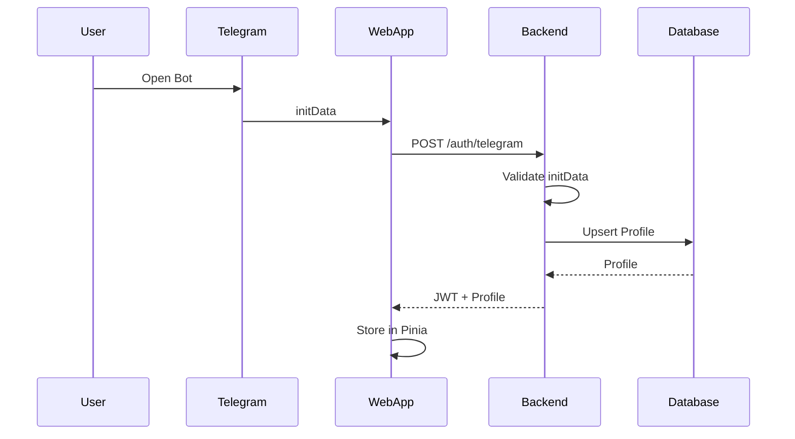
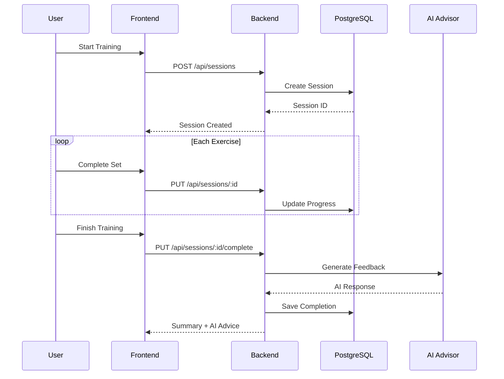
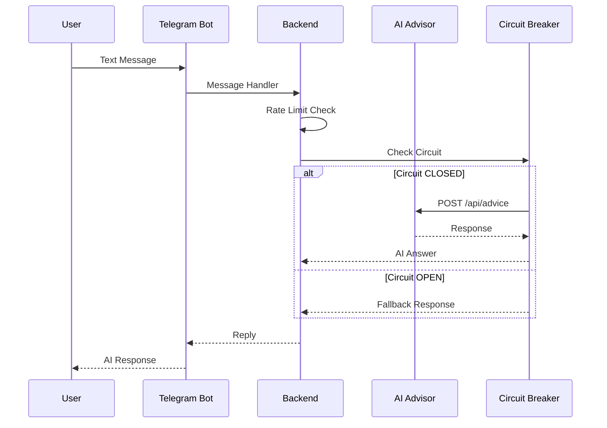

# TZONA Architecture

> Telegram-интегрированный дневник тренировок с AI-функциями

## Overview

```
┌─────────────────────────────────────────────────────────────────┐
│                         TZONA PLATFORM                          │
├─────────────────────────────────────────────────────────────────┤
│  Frontend (Vue 3)  │  Backend (Express)  │  Microservices (Py)  │
│       :5173        │        :3001        │    :3002-3004        │
└─────────────────────────────────────────────────────────────────┘
            │                    │                    │
            ▼                    ▼                    ▼
    ┌──────────────┐    ┌──────────────┐    ┌──────────────┐
    │  Telegram    │    │  PostgreSQL  │    │    Redis     │
    │  WebApp      │    │   (Supabase) │    │   (Cache)    │
    └──────────────┘    └──────────────┘    └──────────────┘
```

## Technology Stack

| Layer | Technology | Purpose |
|-------|------------|---------|
| **Frontend** | Vue 3, Pinia, TypeScript | SPA, Telegram WebApp |
| **Backend** | Express, TypeScript, Prisma | API Gateway, Bot |
| **Microservices** | Python, FastAPI | AI, Analytics, Images |
| **Database** | PostgreSQL (Supabase) | Persistence |
| **Cache** | Redis | Sessions, Rate Limiting |
| **Tunnel** | ngrok | Development access |

---

## Data Flow Diagrams

### 1. User Authentication Flow



### 2. Training Session Flow



### 3. AI Advisor Flow



---

## Component Architecture

### Frontend (Vue 3 + Pinia)

```
frontend/src/
├── pages/                    # Route views
│   ├── TodayPage.vue         # Daily training
│   ├── ExercisesPage.vue     # Programs catalog
│   ├── SettingsPage.vue      # User settings
│   └── ...
├── modules/
│   ├── shared/components/    # Base UI components
│   │   ├── BaseInput.vue
│   │   ├── BaseToggle.vue
│   │   ├── BaseBadge.vue
│   │   └── ...
│   ├── exercises/            # Exercise domain
│   ├── settings/widgets/     # Settings widgets
│   └── today/                # Today domain
├── composables/              # Reusable logic
├── stores/                   # Pinia stores
└── services/                 # API clients
```

### Backend (Express + Prisma)

```
backend/src/
├── bot/
│   ├── commands/             # /start, /help, /today
│   ├── handlers/             # callback_query, message
│   └── helpers/              # Shared utilities
├── routes/                   # Express routes
├── middleware/               # Auth, Rate Limiting
├── modules/
│   ├── infrastructure/       # Health, Logging
│   ├── integrations/         # Supabase, External APIs
│   └── security/             # Brute Force Protection
└── services/
    ├── fetchWithRetry.ts     # HTTP with retry
    ├── circuitBreaker.ts     # Fault tolerance
    └── apiResponse.ts        # Standard responses
```

### Microservices (Python)

```
services/
├── ai-advisor/               # Port 3003
│   ├── main.py               # FastAPI app
│   └── requirements.txt
├── analytics/                # Port 3004
│   └── main.py
└── image-processor/          # Port 3002
    └── main.py
```

---

## Key Patterns

### 1. Circuit Breaker (BE-004)

```typescript
const aiBreaker = serviceBreakers.aiAdvisor();

const advice = await aiBreaker.executeWithFallback(
  () => fetchAI(prompt),
  () => ({ advice: 'Service unavailable', fallback: true })
);
```

### 2. Retry with Backoff (BE-002)

```typescript
const response = await fetchWithRetry(url, options, {
  retries: 3,
  initialDelay: 500,
  backoffFactor: 2,
});
```

### 3. Standard API Response (BE-003)

```typescript
// Success
sendSuccess(res, { user: data });
// { success: true, data: { user: {...} } }

// Error
sendNotFound(res, 'User not found');
// { success: false, error: { code: 'NOT_FOUND', message: '...' } }
```

---

## Deployment

### Development (start-with-ngrok.sh)

```bash
./start-with-ngrok.sh
```

This script:
1. Starts Docker (PostgreSQL, Redis)
2. Creates Python venv and installs dependencies
3. Starts microservices (AI, Analytics, Images)
4. Starts backend and frontend
5. Creates ngrok tunnel
6. Registers webhook with Telegram

### Production

| Component | Deployment |
|-----------|------------|
| Frontend | Vercel / Netlify |
| Backend | Railway / Render |
| Microservices | Docker containers |
| Database | Supabase |
| Bot Webhook | Backend URL |

---

## Database Schema (Prisma)

Key models (20+ total):

```prisma
model Profile {
  id                String    @id @default(uuid())
  telegramId        BigInt    @unique
  firstName         String?
  lastName          String?
  currentProgramId  String?
  createdAt         DateTime  @default(now())
}

model TrainingSession {
  id          String   @id @default(uuid())
  profileId   String
  disciplineId String?
  status      SessionStatus @default(planned)
  plannedAt   DateTime?
  completedAt DateTime?
}

model Exercise {
  id          String   @id @default(uuid())
  title       String
  exerciseKey String   @unique
  equipment   String[]
}
```

---

## Monitoring

| Metric | Endpoint | Tool |
|--------|----------|------|
| Health | `/api/health` | Built-in |
| Metrics | `/api/metrics/dashboard` | Custom |
| Errors | Console + Future Sentry | Logging |

---

*Last updated: December 2024*
